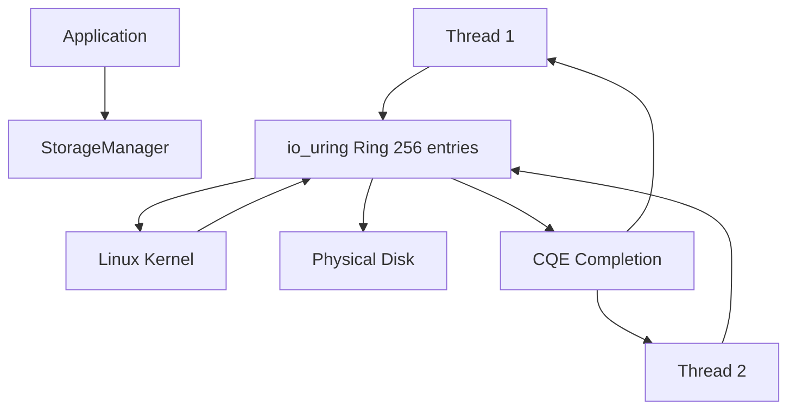
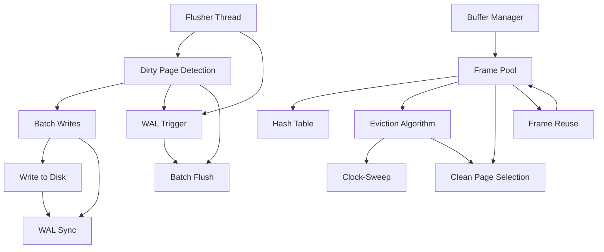
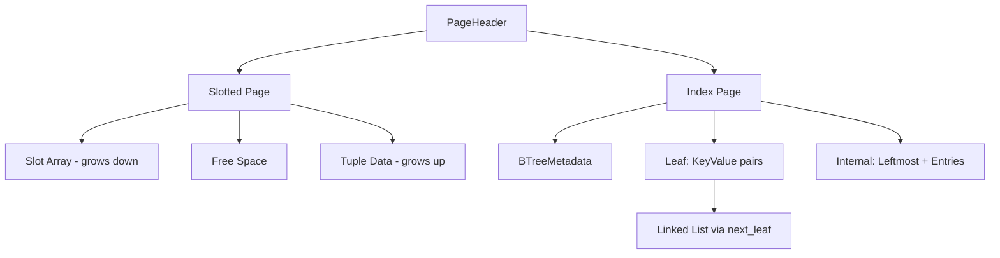
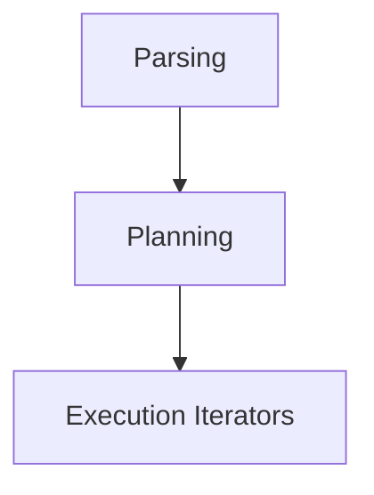
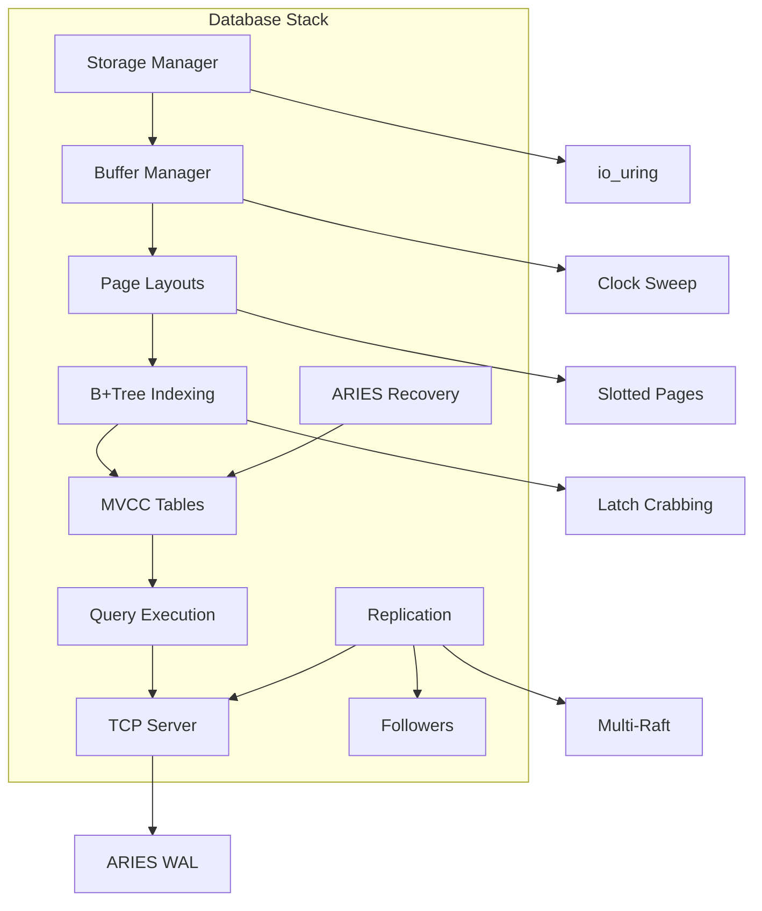

# SimpleDB Architecture

SimpleDB follows a **layered, bottom-up architecture** separating storage, memory, indexing, and networking concerns. Each layer is implemented in Zig 0.16.0 using only `std.Io` primitives for I/O and concurrency, ensuring maximum control over performance and determinism.

## Layer 1: Storage Manager (`src/storage/storage_manager.zig`)

The foundation of SimpleDB. This lowest tier provides **asynchronous, non-blocking I/O** directly with the Linux kernel using `io_uring` (Linux-only).

### Core Capabilities

- **Direct Kernel Access**: Bypasses conventional blocking I/O, submitting SQE (Submission Queue Entries) and waiting for CQE (Completion Queue Entries) via `std.Io`
- **High Throughput**: 256-entry io_uring ring supports up to 128 concurrent page I/O operations
- **Leader-Follower Pattern**: Single leader processes completions; followers yield with `std.Thread.yield()`
- **Page Size**: Strict 8KB pages with 16-byte packed headers

### Architecture Diagram



## Layer 2: Buffer Manager (`src/storage/buffer_manager/buffer_manager.zig`)

Manages a fixed-size pool of **4096 frames** (16MB total) using **Clock-Sweep (Second-Chance) eviction** with per-frame synchronization.

### Key Features

- **Frame Structure**: Each frame contains page_id, pin_count, dirty flag, usage_count, and per-frame `std.Io.RwLock`
- **Hash Table**: 8192-slot inline chained hash map for O(1) lookup
- **Background Threads**: Dedicated `flusher_thread` and `prefetcher_thread` using `io_uring`
- **Clock-Sweep**: Eviction algorithm with retry logic (max pool_size * 12 iterations)

### Thread Management



## Layer 3: Page Layouts (`src/storage/page/`) & SlottedView

Defines the physical format for storing data and indexes. **8KB pages** with **16-byte packed headers** and dual allocation strategies.

### Page Structure

```zig
pub const PageHeader = packed struct(u128) {
    lsn: u32,              // Log Sequence Number
    checksum: u32,          // Page checksum
    lower: u13,             // Offset to free space start (grows down)
    upper: u13,             // Offset to free space end (grows up)
    special: u38,           // Node metadata for index pages
};
```

### Slotted Pages (Data Storage)

- **Variable-length tuples** using dual-space allocation (top for data, bottom for slots)
- **Slot format**: 13-bit offset + 13-bit length
- **Slot count**: Grows downward from page bottom
- **Data area**: Grows upward from page top

### Index Pages (B+Tree)

- **Leaf nodes**: Store `<Key, Record_ID>` pairs with horizontal linked-list for range scans
- **Internal nodes**: Route keys to child pages
- **Metadata**: Stored in 38-bit `special` field: node type (1 bit), key count (13 bits), next_leaf (24 bits)

### Mermaid Diagram



## Layer 4: Indexing (`src/storage/index/`) & Concurrency

Implements **unclustered B+Tree indexing** with **Latch-Crabbing** for high-concurrency access and **Active Node Merging** for efficient deletions.

### BTree Architecture

```zig
pub const BTree = struct {
    buffer_manager: *BufferManager,
    root_page_id: u32,
    next_alloc_page_id: *u32,
    tree_latch: std.Io.RwLock,
};
```

### Latch-Crabbing Protocol

- **Concept**: Hold latches on traversal path, release when safe
- **Safety Conditions**:
  - Insert safe: Node has space (`num_keys < capacity`)
  - Delete safe: Node has enough keys (`num_keys > capacity / 2`)
- **Lock Hierarchy**: Tree → Root → Child → Release when safe

### Active Node Merging

- **Leaf Merges**: Combine underutilized siblings to save space
- **Internal Merges**: Reduce tree depth over time
- **Continuous**: Happens on deletions, not just when full/empty

## Layer 5: Table & Catalog (`src/storage/table.zig`, `src/storage/catalog.zig`)

The **logical tier** coupling B+Tree indexes with slotted pages and providing SQL interface. `Catalog` maps string names to `Table` objects.

### MVCC Support

- **Multi-Version Concurrency Control**: Lock-free reads, concurrent writes
- **Undo Log**: Reconstruct older versions for snapshot isolation
- **Visibility Rules**: `xmin < current_txn AND (xmax == 0 OR xmax > current_txn)`

### Secondary Indexes

- **Dynamic creation** via `CREATE INDEX`
- **Automatic synchronization** on INSERT/DELETE operations
- **Query optimization** for point lookups

## Layer 6: Query Parser & Execution (`src/query/`) & CLI

Implements **custom SQL subset** using hand-written lexer + recursive-descent parser targeting **Volcano-style iterator execution**.

### Query Pipeline



### Statement Types

- **DML**: SELECT, INSERT, UPDATE, DELETE
- **DDL**: CREATE TABLE, CREATE INDEX, DROP TABLE, ALTER TABLE
- **Transaction**: BEGIN, COMMIT, ROLLBACK, PREPARE
- **System**: EXPLAIN, WITH (CTE)

### Execution Engine

- **Iterator Model**: Sequential/index scans, projections, filters, joins, aggregations
- **Cost-Based Optimizer**: Selects optimal join strategies based on statistics
- **CLI/REPL**: Native `--cli` mode for direct terminal interaction

## Layer 7: Interface Tier (`src/server/`) & Replication

Multi-threaded TCP server and distributed systems features for horizontal scaling.

### TCP Server (`src/server/server.zig`)

- **Non-blocking `std.Io` event loops**
- **Multi-threaded** with thousands of concurrent connections
- **ARIES Physical Logging** via WAL before commit acknowledgments

### Leader-Follower Logical Replication

- **Leader**: Accepts reads/writes, broadcasts logical WAL entries
- **Followers**: Read-only replicas applying logical entries to local state
- **Explicit Joint Consensus**: Safe topology changes via `RAFT_CONFIG_UPDATE`

### Consistent Hashing & Sharding

- **Wyhash-based ring** with virtual nodes for dynamic query routing
- **Router REPL**: `ROUTER ADD`, `ROUTER REMOVE`, `ROUTER GET` commands

## Recovery & Concurrency Control

### ARIES Crash Recovery

1. **REDON**: Replay committed transactions from last checkpoint
2. **UNDO**: Rollback uncommitted transactions
3. **TRUNCATE**: Clean up stale WAL entries

### Distributed Deadlock Detection

- **Global Wait-For Graphs**: Gossip protocol for cross-node cycle detection
- **Immediate Abort**: Cycle triggers distributed transaction abort

## Trade-offs & Design Decisions

### Advantages

- **Control**: Every system aspect is optimized for performance
- **Correctness**: Bottom-up testing ensures primitives are 100% correct
- **Scalability**: `io_uring`, latch-crabbing, and replication enable high throughput

### Disadvantages

- **Complexity**: Manual memory management and low-level I/O require expertise
- **Linux-only**: `io_uring` dependency
- **Maintenance**: More code than using OS abstractions

## Mermaid: Overall Architecture



This architecture demonstrates SimpleDB's commitment to **performance**, **correctness**, and **flexibility** through layers that can be understood, tested, and optimized independently.
