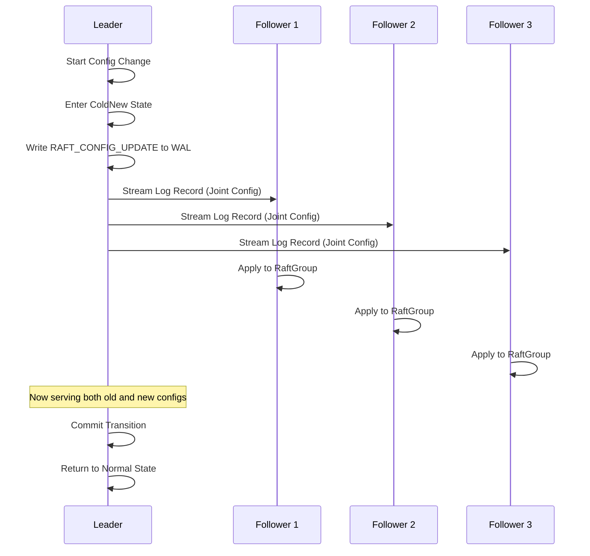
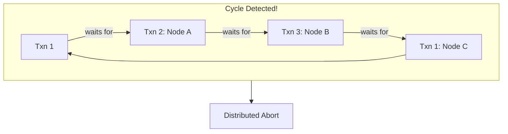
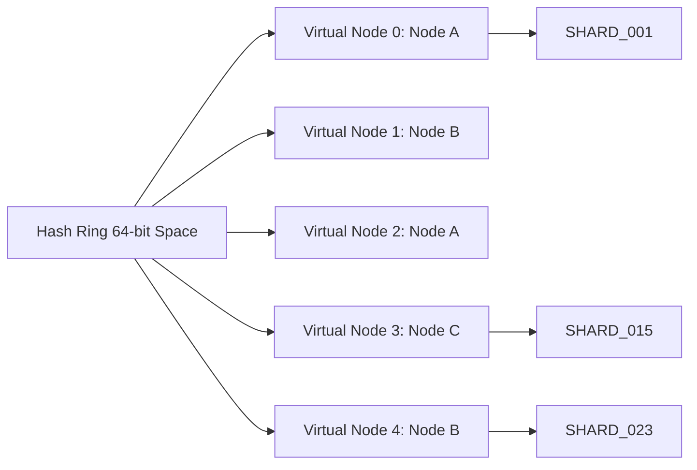
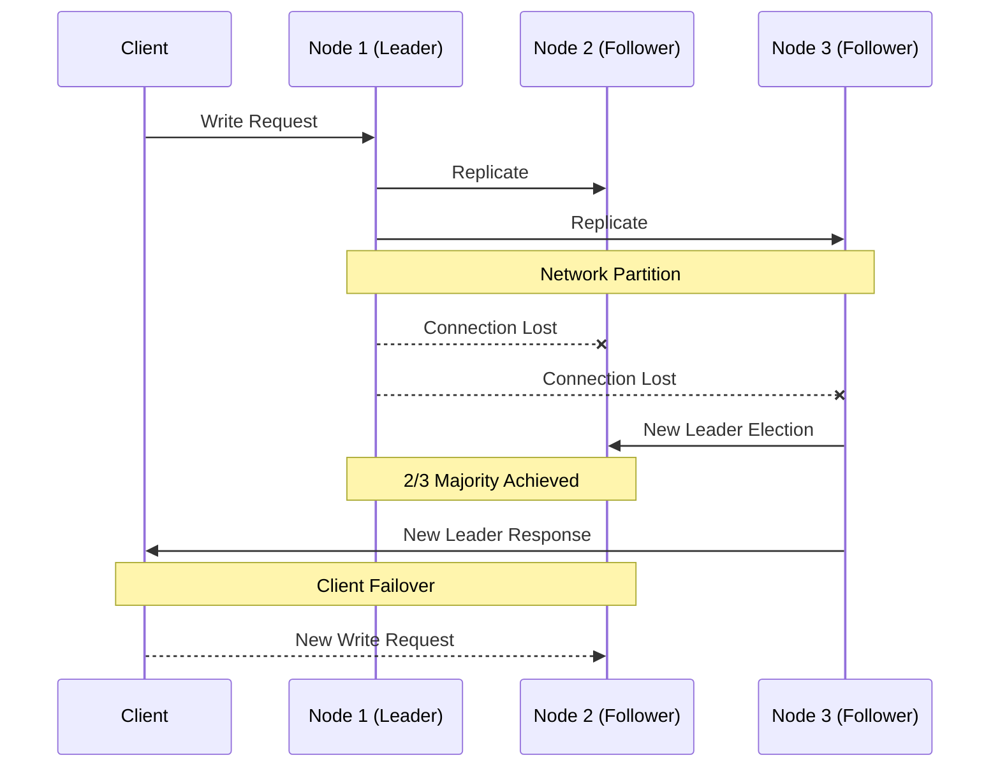

# Distributed Systems

SimpleDB includes robust, fully-implemented distributed systems features allowing nodes to operate as clustered replicas or sharded environments. These features build on top of the core storage engine to provide horizontal scalability and fault tolerance.

## 1. Multi-Raft & Explicit Joint Consensus

SimpleDB implements a custom **Multi-Raft** architecture to handle replication with safety guarantees during topology changes.

### TCP WAL Streaming

Instead of traditional snapshot shipping, Leaders chunk and base64-encode physical WAL `LogRecord` segments, streaming them seamlessly via TCP:

```
Leader --> [RAFT_APPEND_ENTRIES] --> Followers
```

### Phase 3 Joint Consensus (`RAFT_CONFIG_UPDATE`)

Topological cluster changes (adding or removing nodes) are executed safely via **Explicit Joint Consensus** ($C_{old,new}$):

1. Leader transitions to `.ColdNew` state
2. Emits a `.raft_config_change` entry to WAL
3. Follower replicates the change and hot-reloads local `RaftGroup` topology
4. No downtime during configuration changes



## 2. Distributed Deadlock Detection

Instead of local wait-for graphs, SimpleDB employs **Global Wait-For Graphs** via Gossip for cross-node cycle detection.

### How It Works

1. When a transaction waits on a lock, it broadcasts its wait-for edge to the cluster via Gossip
2. Each node maintains a partial view of the global wait-for graph
3. When a cycle is detected anywhere in the graph, the system triggers an immediate **distributed abort mechanism**

### Benefits

- **No single point of failure**: Detection is decentralized
- **Fast recovery**: Cycles are detected and resolved quickly
- **Scalable**: Works across large clusters



## 3. Consistent Hashing (Sharding Ring)

SimpleDB includes a native **Sharding Ring** using **Wyhash** with Virtual Nodes for dynamic query routing.

### Architecture

- **Hash Function**: Wyhash provides fast, high-quality hashing with good distribution
- **Virtual Nodes**: Each physical node appears multiple times in the ring for balanced load distribution
- **Dynamic Membership**: Adding/removing nodes only moves ~1/N of keys

### Router REPL

Interact with the router directly:

```
ROUTER ADD {peer}        – Add a node to the cluster
ROUTER REMOVE {peer}     – Remove a node from the cluster
ROUTER GET {table}#{pk}  – Determine which shard owns a specific key
```



## 4. Leader-Follower Logical Replication

SimpleDB supports **horizontal read scaling** via leader-follower replication:

- **Leader**: Accepts read and write queries; broadcasts logical WAL entries
- **Followers**: Read-only replicas applying logical entries to local state

### Logical Replication Flow

1. Transaction commits to Leader's WAL
2. Leader generates logical WAL entries (`logical_insert`, `logical_delete`, `logical_update`)
3. Entries streamed to followers over TCP
4. Followers apply to local catalog and B+Tree structures
5. DDL statements automatically instantiate new pages in real-time

## 5. Jepsen-style Chaos Testing

The project includes a Python Chaos Harness (`tests/chaos_test_log.py`) that validates system behavior under network partitions.

### Test Scenarios

1. Spins up multiple `simpledb` processes
2. Injects `SIGSTOP` network partitions mid-execution (kills followers and Leaders)
3. Validates that:
   - Multi-Raft successfully auto-elects a new leader maintaining 2/3 majority
   - Unacknowledged writes fail safely
   - Node recovery and state reconciliation remains 100% ACID compliant after partition heals



## 6. RPC Protocol

SimpleDB uses a custom text-based RPC protocol over TCP with these message types:

| Message Type | Direction | Description |
||-------------||-----------|-------------|
| `RAFT_APPEND_ENTRIES` | Leader → Followers | WAL replication |
| `RAFT_REQUEST_VOTE` | Follower → Candidates | Election vote request |
| `RAFT_INSTALL snapshots` | Previous Leader → New Leader | State transfer |
| `RAFT_CONFIG_UPDATE` | Leader → All | Joint consensus config change |
| `PUT` | Client → Server | Update operation |
| `GET` | Client → Server | Point lookup |
| `SCAN` | Client → Server | Range scan |

## Running Distributed Tests

```bash
# Run all integration tests
./run_all_tests.sh

# Run specific distributed tests
python3 tests/integration/test_raft_election.py
python3 tests/integration/test_replication_consistency.py
python3 tests/integration/test_sharding.py
python3 tests/chaos_test_log.py
```
