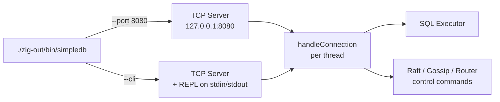

# Connecting to SimpleDB

SimpleDB exposes two user-facing interfaces from a single binary: a **TCP server** for programmatic clients and a **REPL/CLI** for interactive use. Both speak the same line-based text protocol on top of `std.Io.net.Stream`, so a script that works against the TCP port also works in the REPL (with the addition of `.help`/`.exit`).



## Building the binary

SimpleDB builds with Zig 0.16.0:

```bash
zig build
# produces ./zig-out/bin/simpledb
```

The same binary is used for the standalone TCP server and the interactive CLI. Mode is selected by flags; there is no separate "client" binary.

## Starting the TCP server

The default mode is `server-only`:

```bash
./zig-out/bin/simpledb
# SimpleDB: Tables & Concurrency!
# Starting SimpleDB TCP Server on port 8080...
# Server listening on 127.0.0.1:8080
```

### Command-line flags

| Flag | Default | Purpose |
|------|---------|---------|
| `--port <N>` | `8080` | TCP listen port. The data filename is derived as `data/simple_<port>.db`. |
| `--data-dir <path>` | `data` | Directory for the page file and WAL. The directory is created implicitly when SimpleDB first opens it. |
| `--replica-of <addr>` | _(none)_ | Starts this node as a follower of the given leader (e.g. `127.0.0.1:8080`). Rejects writes with `ERR cannot write to a read-only replica`. |
| `--seed <addr>` | _(none)_ | Gossip seed node. May be passed multiple times to join a cluster. |
| `--shard-id <N>` | `0` | Logical shard identifier when running a sharded cluster. |
| `--num-shards <N>` | `1` | Total shard count. Used with `--shard-id` for routing. |
| `--cli` | _off_ | Runs the interactive REPL after spawning the server in a background thread. |

A typical multi-shard startup:

```bash
./zig-out/bin/simpledb --port 8080 --num-shards 2 --shard-id 0
./zig-out/bin/simpledb --port 8081 --num-shards 2 --shard-id 1 --seed 127.0.0.1:8080
```

The server is currently bound to `127.0.0.1` only; remote clients must tunnel/forward that loopback. There is no TLS layer — the wire format is plain UTF-8 text.

## Starting the REPL

The REPL wraps the same TCP server, so the database is reachable on the configured port while a prompt is attached to your terminal:

```bash
./zig-out/bin/simpledb --cli
# Welcome to SimpleDB CLI!
# Type .help for instructions, or .exit to quit.
# Starting SimpleDB TCP Server on port 8080 in background...
# simpledb>
```

The prompt is `simpledb>` outside a transaction and `simpledb(txn)>` between `BEGIN` and `COMMIT`/`ROLLBACK`.

### REPL dot-commands

| Command | Effect |
|---------|--------|
| `.help` | Prints a one-line summary of commands. |
| `.exit` / `.quit` | Leaves the REPL. The background TCP server is unaffected. |

Anything else is parsed as a SQL statement. There is no multi-line SQL continuation in the REPL — each line is a complete statement terminated by `;`. Empty lines and lines that are just whitespace are ignored.

## Wire protocol

Every command — whether typed at the REPL or sent over TCP — is a **single line of UTF-8 text terminated by `\n` (or `\r\n`)**. The server accumulates bytes into a 128 KiB read buffer, splits on line breaks, and processes each line independently. Lines are processed in receive order; multiple statements may be pipelined in one write and answers come back sequentially in the same order.

A statement with a trailing `;` (e.g. `SELECT 1;`) is the canonical form; the server accepts the same statement without the trailing semicolon.

### Request/response model

The server replies with **one response per line**, flushed immediately for every command. Reading the answer is a single `recv()` of arbitrary size — there is no explicit length prefix or framing beyond newlines. For a small `SELECT` the response fits in one packet; large result sets are emitted as a stream of `value | value | value\n` lines followed by a final `OK\n`.

Two acknowledgement forms cover most traffic:

- **`OK\n`** — non-query statements succeeded (`INSERT`, `UPDATE`, `DELETE`, `CREATE`, `DROP`, `BEGIN`, `COMMIT`, `ROLLBACK`, plus the control commands below).
- **`OK` rows then `OK\n`** — `SELECT` results, one row per line, columns separated by ` | `, ending with a trailing `OK` on its own line.

Errors use the prefix **`ERR`** followed by a short human-readable reason:

```
ERR PARSER: <parser error>
ERR EXEC: <execution error>
ERR cannot write to a read-only replica
ERR already in transaction
ERR no nodes in ring
```

When the server itself fails (out of memory, fatal I/O), the connection is closed without a response and the client observes EOF on `recv()`.

### Connection lifecycle

Each TCP connection is handled by `handleConnection` in a dedicated thread (`src/server/connection.zig`). The handler:

1. Reads lines until EOF.
2. Routes `ROUTER_*` / `RAFT_*` / `START_REPLICATION <lsn>` to internal subsystems — these never reach the SQL parser.
3. Otherwise hands the line to the SQL parser; the parsed statement runs against the catalog with a transaction context derived from `BEGIN` or auto-started for the first write.
4. Closes the socket and aborts the transaction automatically if the client disconnects mid-transaction (the deferred cleanup in `handleConnection` undoes outstanding writes and writes an `abort` WAL record).

There is no connection-level handshake, authentication, or startup packet — open the socket, send a SQL statement, read the reply.

## Connecting from Python

The simplest client is `socket.create_connection` plus a newline-terminated send. This example mirrors the official test suite (`tests/integration/test_server.py`):

```python
import socket

HOST, PORT = "127.0.0.1", 8080

def query(sql: str, timeout: float = 5.0) -> str:
    """Send one statement and read everything the server sends back."""
    with socket.create_connection((HOST, PORT), timeout=timeout) as s:
        s.sendall(sql.encode("utf-8") + b"\n")
        chunks = []
        while True:
            chunk = s.recv(65536)
            if not chunk:        # server closed the connection
                break
            chunks.append(chunk)
            # Stop once we have seen a terminating OK/ERR.
            data = b"".join(chunks)
            if data.rstrip().endswith(b"OK") or data.startswith(b"ERR"):
                break
        return data.decode("utf-8")

print(query("CREATE TABLE users (id INT, name VARCHAR(100));"))
print(query("INSERT INTO users VALUES (1, 'Alice');"))
print(query("SELECT * FROM users;"))
```

For multi-statement transactions on a single connection, send all lines on the same socket:

```python
with socket.create_connection((HOST, PORT)) as s:
    for line in [
        "BEGIN;",
        "INSERT INTO users VALUES (2, 'Bob');",
        "UPDATE users SET name = 'Bobby' WHERE id = 2;",
        "COMMIT;",
    ]:
        s.sendall(line.encode() + b"\n")
        # Each line is independent; recv() gives the per-line reply.
        print(s.recv(4096).decode().strip())
```

The integration test `test_04_transactions` follows exactly this pattern and verifies that a `ROLLBACK` discards the prior `INSERT` while a `COMMIT` persists it.

## Connecting from other languages

Any TCP-capable client works because the protocol is plain line-delimited text:

- **Node.js** — wrap a `net.Socket`, write `sql + "\n"`, drain `data` events.
- **Go** — use `net.Dial` plus a `bufio.Scanner` for the response.
- **Bash / `nc`** — for ad-hoc testing: `printf 'SELECT 1;\n' | nc -q 1 127.0.0.1 8080`.
- **curl** — *not* supported; the server speaks raw TCP, not HTTP.

A minimal `nc` smoke test that verifies the server is alive:

```bash
printf 'SELECT 1;\n' | nc 127.0.0.1 8080
# expected: a single row like "1", then "OK"
```

## Error handling

A robust client should treat any line beginning with `ERR` as a failed statement and **not** assume the transaction state is unchanged for `ERR PARSER` / `ERR EXEC` lines that arrive after `BEGIN`. Concretely:

| Surface | Behaviour |
|---------|-----------|
| Syntax error | `ERR PARSER: <message>\n` — connection stays open, no transaction is opened. |
| Runtime / execution error | `ERR EXEC: <message>\n` — the auto-started transaction is rolled back; the connection stays open. |
| `BEGIN` while already in a transaction | `ERR already in transaction\n`. |
| Write to a read-only replica | `ERR cannot write to a read-only replica\n` (only `SELECT`, `BEGIN`, `COMMIT`, `ROLLBACK` are allowed on a replica). |
| `ROUTER GET <key>` with no nodes | `ERR no nodes in ring\n`. |
| Socket closed mid-transaction | The server appends an `abort` WAL record and undoes the partial work automatically. The client simply sees EOF. |
| Server crash | The next `recv()` on any open client returns 0 bytes. Reconnect and retry; the recovered state reflects whatever was committed before the crash. |

For long-running clients, add a small read timeout and reconnect on `socket.timeout` — the server has no keep-alive ping and will not notice a half-open connection until the next `read` attempt fails.

## Control-plane commands

Outside SQL, the server accepts a handful of internal commands routed before the parser. They share the same line protocol and the same `OK` / `ERR` replies. They are typically only used by tests and operator tooling.

### Routing (consistent-hash ring)

| Command | Reply | Purpose |
|---------|-------|---------|
| `ROUTER ADD <node>` | `OK` | Add `<node>` (e.g. `127.0.0.1:8081`) to the hash ring. |
| `ROUTER REMOVE <node>` | `OK` | Remove `<node>` from the ring. |
| `ROUTER GET <key>` | `<owner-node>\n` or `ERR no nodes in ring` | Return the node that owns `<key>`. |

### Raft

Any line beginning with `RAFT_` is dispatched to the Raft group. `RAFT_CONFIG_UPDATE ...` switches the raft config (joint consensus) and replies `OK` on success or `ERR <reason>` on failure; other `RAFT_*` messages are forwarded to the Raft state machine and produce no direct response on the same connection. See [sharding](../features/sharding.md) and [replication](../features/replication.md) for the operational context.

### Logical replication stream

`START_REPLICATION <lsn>` hijacks the connection: from that line onward the server streams the WAL from `<lsn>` instead of executing SQL, and the connection never returns to command mode. This is the wire format used between a leader and a follower (see `src/server/replication.zig`).

## Quick start

End-to-end: from a clean checkout to a working query in five commands.

```bash
# 1. Build
zig build

# 2. Start a single-node server (in another terminal, or backgrounded)
./zig-out/bin/simpledb --port 8080 &

# 3. Wait for it to be reachable
until printf '\n' | nc -z 127.0.0.1 8080; do sleep 0.2; done

# 4. Run a query
printf "CREATE TABLE hello (id INT, msg VARCHAR);\nINSERT INTO hello VALUES (1, 'world');\nSELECT * FROM hello;\n" | nc 127.0.0.1 8080

# 5. Or attach a REPL
./zig-out/bin/simpledb --cli --port 8080
# simpledb> SELECT * FROM hello;
# 1 | world
# OK
```

## See also

- [storage.md](./storage.md) — page layout, WAL, B+Tree.
- [sql_reference.md](./sql_reference.md) — full SQL grammar and data types.
- [transactions.md](./transactions.md) — `BEGIN` / `COMMIT` / `ROLLBACK` semantics and isolation.
- [replication.md](./replication.md) — `--replica-of` and the `START_REPLICATION` stream.
- [sharding.md](./sharding.md) — `--shard-id` / `--num-shards` and the `ROUTER *` commands.
- [implementation/server/architecture.md](../implementation/server/architecture.md) — internal server design.
