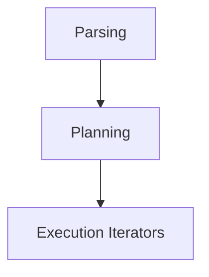

---
# Querying

- Custom SQL subset parsed by a hand‑written lexer and recursive‑descent parser.
- AST → Volcano iterator model for execution planning.
- Supported operations: sequential scan, index scan, projection, selection, hash aggregation, sort‑merge join, nested‑loop join, ALTER TABLE.
- Planner uses simple cost model (scan cost, index selectivity).

