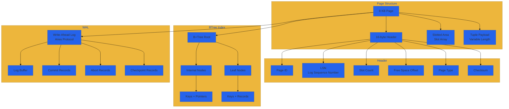

# Storage

- Page-based storage with 8 KB pages.
- io_uring-backed asynchronous non-blocking I/O.
- Slotted pages for variable-length tuples; packed 16-byte header.
- B+Tree indexes for primary and secondary keys.
- Durability via Write-Ahead Log (Aries).

