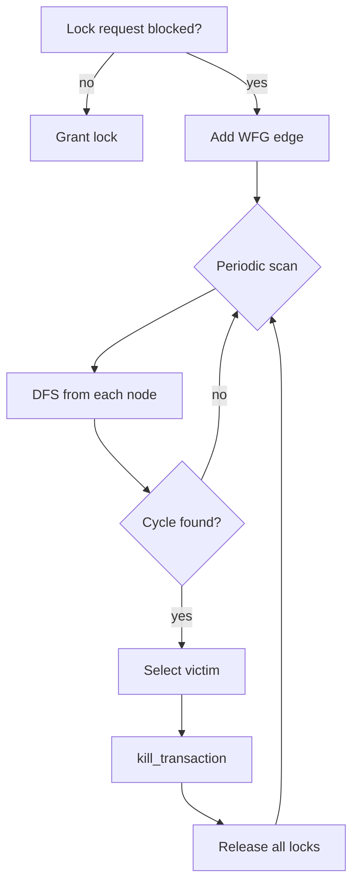
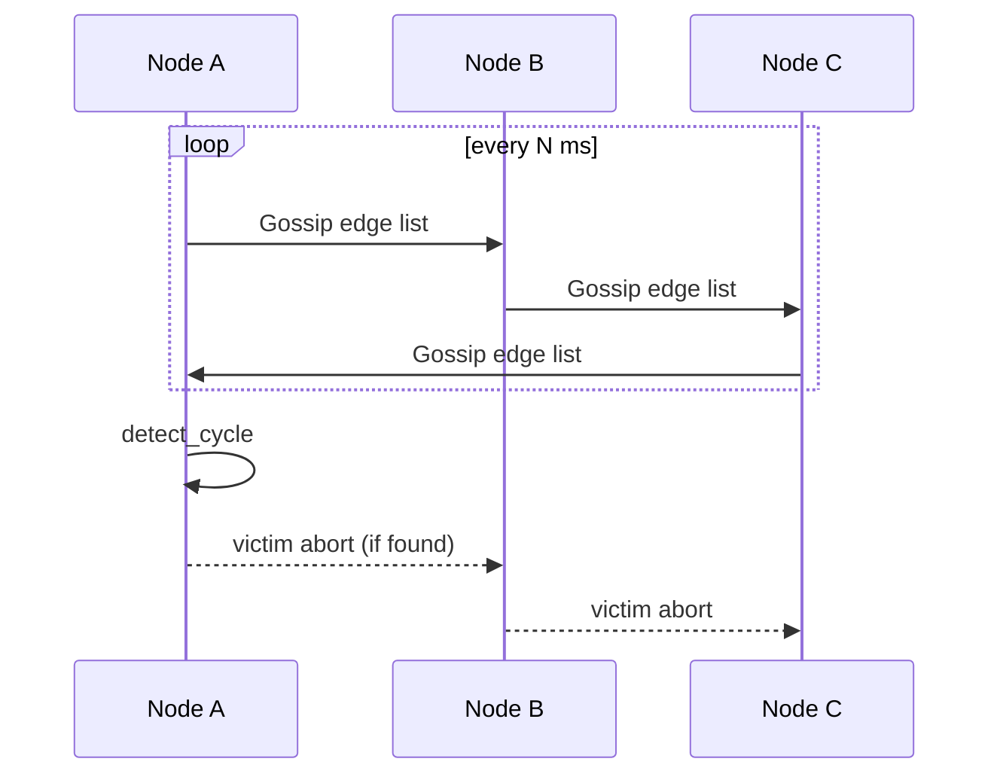

# Wait‑For Graph (WFG) Implementation

## Overview

The **Wait‑For Graph (WFG)** is a directed graph used for deadlock detection in Simpledb. It models the wait relationships between transactions: an edge from transaction **T₁** to **T₂** means “T₁ is waiting for a lock that T₂ currently holds.” A **cycle** in this graph indicates a deadlock.

## Data Structure

### Edge

```zig
pub const Edge = struct { waiting: u32, holding: u32 };
```

Each `Edge` represents one wait relationship:

| Field | Description |
|-------|-------------|
| `waiting` | Transaction ID that is blocked |
| `holding` | Transaction ID that currently holds the contested resource |

### GlobalWFG

```zig
pub const GlobalWFG = struct {
    allocator: std.mem.Allocator,
    edges: std.ArrayList(Edge),
    // ... methods
};
```

The graph is represented as an adjacency list materialized as a flat `ArrayList` of edges. Lookups are linear in the number of edges (sufficient for in‑process use; a distributed version would index edges for O(1) access).

## Cycle Detection Algorithm

The algorithm uses **depth‑first search (DFS)** with three coloring states:

```
+-------+     visit node
|       |
v       |
GRAY -->  (add to stack, mark as in-progress)
|  ^
|  |     find neighbor -> if GRAY: CYCLE!
|  |  +--+
|  +--|--+
|     |  |
+-----+  v
       BLACK  (fully processed, leave stack)
```

### Pseudocode

```
dfs(node, visited, stack):
    if node in stack:          → cycle detected
        return node
    if node in visited:        → already processed
        return null

    mark node as visited
    mark node as in stack

    for each edge (node -> neighbor):
        if dfs(neighbor) finds cycle:
            return cycle node

    remove node from stack
    return null
```

### Implementation

The `detect_cycle` method iterates over all known nodes (extracted from edges) and launches a fresh DFS:

```zig
pub fn detect_cycle(self: *GlobalWFG) ?u32 {
    var visited = std.AutoHashMap(u32, bool).init(self.allocator);
    defer visited.deinit();
    var stack = std.AutoHashMap(u32, bool).init(self.allocator);
    defer stack.deinit();

    var nodes = std.AutoHashMap(u32, void).init(self._allocator);
    for (self.edges.items) |e| {
        nodes.put(e.waiting, {}) catch {};
        nodes.put(e.holding, {}) catch {};
    }

    var it = nodes.keyIterator();
    while (it.next()) |node| {
        if (self.dfs(node.*, &visited, &stack)) |cycle_txn| {
            return cycle_txn;
        }
    }
    return null;
}
```

When a cycle is found, the **victim transaction** is selected by aborting the transaction with the **highest transaction ID** (`@max(node, cycle_txn)`). This deterministic tie‑breaker ensures reproducibility.

## Victim Selection

When a deadlock is detected:

1. **Identify cycle participants** – all transactions in the cycle.
2. **Choose victim** – the highest txn_id in the cycle (implemented as `@max(node, cycle_txn)` in the DFS unwind).
3. **Mark for abort** – `kill_transaction(victim)` is called on the lock manager, which:
   - Adds the txn to `killed_txns`.
   - Broadcasts on every lock queue’s condition variable, waking all blocked transactions.

The victim’s locks are then released via `unlock_internal`, breaking the cycle and allowing other victims to abort.

## Gossip Propagation for Distributed Detection

In a multi-node deployment, each node maintains a **local WFG subgraph**. To achieve cluster-wide deadlock detection without a central coordinator:

1. **Local edge discovery** – each node runs `get_wait_for_edges` and builds its local edge list.
2. **Gossip exchange** – nodes periodically (e.g., every 100 ms) exchange their edge lists using the cluster’s gossip layer.
3. **Merge** – upon receiving edges from a peer, a node appends them to its local `GlobalWFG.edges` (duplicates are ignored).
4. **Detect locally** – each node runs `detect_cycle` on its merged graph. Any node discovering a cycle initiates the victim selection process.
5. **Abort propagation** – the victim’s abort signal is gossiped to other nodes, causing them to mark the transaction as killed and release resources.

```
+-------+       +-------+       +-------+
| Node A| ----> | Node B| ----> | Node C|
+-------+       +-------+       +-------+
    |               ^               |
    +---------------+----------------+
        gossip rounds (interval ~100ms)
```

Benefits:

- No single point of failure.
- Eventual consistency: all nodes converge on the same WFG view.
- High throughput: local lock acquisitions never block on network.

## Integration with Lock Manager

The lock manager produces WFG edges via `get_wait_for_edges`:

```zig
pub fn get_wait_for_edges(
    self: *LockManager,
    list: *std.ArrayList(@import("wfg.zig").Edge)
) !void {
    self.mutex.lockUncancelable(self.io);
    defer self.mutex.unlock(self.io);

    var it = self.lock_table.valueIterator();
    while (it.next()) |queue_ptr| {
        const queue = queue_ptr.*;
        for (queue.requests.items) |req_wait| {
            if (!req_wait.granted) {
                for (queue.requests.items) |req_hold| {
                    if (req_hold.granted and req_hold.txn_id != req_wait.txn_id) {
                        try list.append(self.allocator, .{
                            .waiting = req_wait.txn_id,
                            .holding = req_hold.txn_id,
                        });
                    }
                }
            }
        }
    }
}
```

This function is invoked periodically (or upon lock timeout) to reconstruct the wait‑for relationships from the lock table state.

## Mermaid Diagrams

### WFG Cycle Detection Flow



### Distributed Gossip



## Trade-offs & Design Decisions

| Decision | Rationale |
|----------|-----------|
| Adjacency list as flat `ArrayList` | Simplicity; cycle detection O(V+E) is acceptable for typical transaction counts |
| Highest txn_id as victim | Deterministic, no need for cost model; aborts are relatively rare |
| 10 ms spin with 100 retries | Balances CPU usage against deadlock detection latency |
| No global mutex during DFS | The WFG snapshot is built lock‑free from the lock manager’s edge extraction; DFS runs on a copy |

## Cross-Links

- **Lock Manager**: [`src/storage/concurrency/lock_manager.zig`](../lock_manager.md)
- **MVCC**: See `src/storage/concurrency/mvcc.md`
- **Server/Replication**: See `src/server/replication.zig` for gossip transport

---

*Documentation generated from `src/storage/concurrency/wfg.zig`*