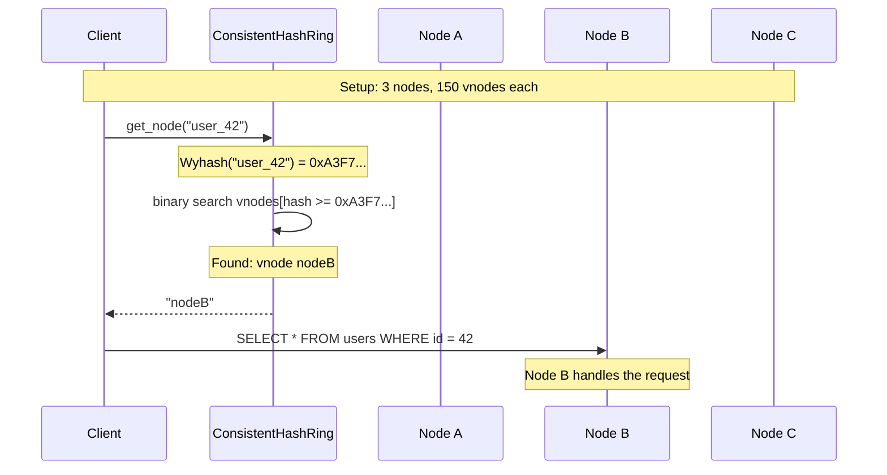
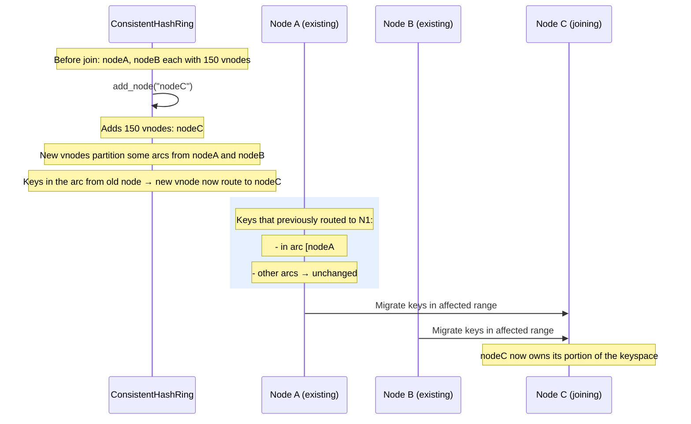

# Consistent Hashing — Shard Routing

## Overview

The `ConsistentHashRing` in `src/server/consistent_hash.zig` implements **consistent hashing** for distributing keys (e.g., user IDs, table names) across physical nodes in a sharded SimpleDB cluster. It uses virtual nodes (`vnodes`) to achieve uniform load distribution even when nodes join or leave.

The algorithm is based on the "consistent hashing" technique (Karger et al., 1997) adapted with virtual nodes for better load balancing.

Source: `src/server/consistent_hash.zig`

---

## Data Structures

### `VirtualNode`

```zig
pub const VirtualNode = struct {
    hash: u64,
    physical_node: []const u8,
};
```

A virtual node represents one "slot" on the ring. Multiple virtual nodes map to the same physical node, providing fine-grained distribution.

### `ConsistentHashRing`

```zig
pub const ConsistentHashRing = struct {
    vnodes: std.ArrayList(VirtualNode),
    allocator: std.mem.Allocator,
    vnodes_per_physical: usize,
};
```

The ring is stored as a **sorted array** of virtual nodes. The sort order is by `hash` ascending, which enables binary search for key lookup.

---

## Algorithm

### Adding a Node — `add_node`

**Source:** `src/server/consistent_hash.zig:33–43`

For each physical node, `vnodes_per_physical` virtual nodes are created:

```zig
pub fn add_node(self: *ConsistentHashRing, node_id: []const u8) !void {
    var buf: [256]u8 = undefined;
    for (0..self.vnodes_per_physical) |i| {
        const vnode_key = try std.fmt.bufPrint(&buf, "{s}#{d}", .{ node_id, i });
        const hash = std.hash.Wyhash.hash(0, vnode_key);

        const p_node = try self.allocator.dupe(u8, node_id);
        try self.vnodes.append(self.allocator, .{ .hash = hash, .physical_node = p_node });
    }
    std.mem.sortUnstable(VirtualNode, self.vnodes.items, {}, cmpVirtualNode);
}
```

Key observations:
- **Hash function:** `std.hash.Wyhash.hash(0, vnode_key)` — a fast non-cryptographic hash (Wyhash WYS).
- **Virtual node key:** `{node_id}#{i}` — e.g., `nodeA#0`, `nodeA#1`, `nodeA#2`.
- **Sorting:** After each `add_node`, the entire vnode array is re-sorted. This is O(n log n) per addition, which is acceptable for small clusters but could be improved with an ordered map in production.
- **Memory:** Each `physical_node` string is heap-allocated and owned by the vnode entry.

### Removing a Node — `remove_node`

**Source:** `src/server/consistent_hash.zig:45–55`

```zig
pub fn remove_node(self: *ConsistentHashRing, node_id: []const u8) void {
    var i: usize = 0;
    while (i < self.vnodes.items.len) {
        if (std.mem.eql(u8, self.vnodes.items[i].physical_node, node_id)) {
            self.allocator.free(self.vnodes.items[i].physical_node);
            _ = self.vnodes.orderedRemove(i);  // O(n) per removal
        } else {
            i += 1;
        }
    }
}
```

Uses `orderedRemove` (shifts subsequent elements). Total cost: O(n) where n = total vnodes. No re-sort is needed since the ordering is preserved when removing individual entries.

### Key Lookup — `get_node`

**Source:** `src/server/consistent_hash.zig:57–79`

```zig
pub fn get_node(self: *ConsistentHashRing, key: []const u8) ?[]const u8 {
    const hash = std.hash.Wyhash.hash(0, key);

    var left: usize = 0;
    var right: usize = self.vnodes.items.len;

    while (left < right) {
        const mid = left + (right - left) / 2;
        if (self.vnodes.items[mid].hash < hash) {
            left = mid + 1;
        } else {
            right = mid;
        }
    }

    if (left == self.vnodes.items.len) {
        return self.vnodes.items[0].physical_node;  // wrap around
    }

    return self.vnodes.items[left].physical_node;
}
```

The binary search finds the **first virtual node with hash ≥ key hash** — the clockwise successor on the ring. If the key's hash is greater than all vnode hashes, it wraps around to the first entry (line 75).

---

## Ring Visualization

```
                         hash=0 (mod 2^64)
                              │
                              ▼
          ┌─────────────────────────────────────┐
          │                                     │
    hash=◄─┘                                     │
    nodeC#2                                      │
                                                 │
                 hash=nodeA#1                    │
                 nodeA#1                         │
                      ◄─────────── key "user_5" (hash falls here)
                                                     │
                         hash=nodeB#0              │
                         nodeB#0                    │
                              │                     │
                              ▼                     │
          ┌─────────────────────────────────────┘
          │
    hash=nodeC#1
    nodeC#1
```

With 3 physical nodes × N vnodes per physical:
- Adding `nodeA`: creates `nodeA#0`..`nodeA#N-1` at random positions
- Removing `nodeA`: all `nodeA#i` entries are removed; only keys in those arcs remap
- **Minimum disruption:** Only keys in the arc from `nodeA` to the next physical node are remapped — O(1/n) of total keys for n nodes

---

## Mermaid Sequence — Sharding a Key



---

## Mermaid Sequence — Node Join



---

## Load Balancing Properties

Without virtual nodes (1 vnode per physical), the hash space is divided into large arcs. The probability that a node's arc is proportionally sized depends entirely on the random distribution of its single hash — this has high variance for small clusters.

With virtual nodes:
- Each physical node contributes `vnodes_per_physical` entries to the hash space
- The effective arc size for each physical node is `vnodes_per_physical / total_vnodes` of the ring
- **Standard deviation of load** decreases as `O(1/sqrt(vnodes_per_physical))`
- Typical recommendation: 100–200 vnodes per physical node

The implementation accepts `vnodes_per_physical` as a constructor parameter, allowing tuning per deployment.

---

## Trade-offs

| Aspect | Decision | Trade-off |
|--------|----------|-----------|
| **Hash function** | `std.hash.Wyhash` | Very fast (SIMD-friendly); not cryptographic; collision probability acceptable for load balancing |
| **Storage** | Sorted `ArrayList` | Simple; `add_node` re-sorts O(n log n); `remove_node` is O(n) |
| **Binary search** | `O(log n)` lookup | Excellent for large clusters; 20 vnodes per physical × 100 nodes = 2000 vnodes → ~11 comparisons |
| **Virtual nodes** | Parameterized `vnodes_per_physical` | Allows tuning load balance vs memory; more vnodes = better balance but more storage |
| **No versioning** | No epoch/sequence numbers | Concurrent adds/removes in a distributed setting could cause brief inconsistencies; acceptable for single-process use |
| **No hint table** | Full binary search each time | Fine for read-heavy workloads; could cache common lookups |
| **Wrapping** | `left == vnodes.len → return vnodes[0]` | Correct ring semantics; the "last" virtual node is the clockwise boundary before wrapping |
| **Empty ring** | Returns `null` if `vnodes.items.len == 0` | Safe; callers must handle this (e.g., before any nodes are added) |
| **Key type** | `[]const u8` (arbitrary bytes) | Table names, user IDs, or any string can be used as a routing key |
| **No replicas** | Single owner per key | Does not provide replication; Raft handles that separately |
| **No split** | Keyspace partitioning only | Does not redistribute data — migration must be done by the caller |

---

## Relationship to Sharding

The consistent hash ring is the **routing layer** between the client's key and the physical node. The full sharding pipeline is:

1. Client computes `node = ring.get_node(shard_key)`
2. Client routes request to that node (via TCP)
3. Raft on that node manages leader election and config for the shard
4. WAL replication streams from the shard's leader to its followers

---

## File Reference

| Symbol | File | Line |
|--------|------|------|
| `VirtualNode` struct | `src/server/consistent_hash.zig` | 3 |
| `ConsistentHashRing` struct | `src/server/consistent_hash.zig` | 13 |
| `ConsistentHashRing.add_node` | `src/server/consistent_hash.zig` | 33 |
| `ConsistentHashRing.remove_node` | `src/server/consistent_hash.zig` | 45 |
| `ConsistentHashRing.get_node` | `src/server/consistent_hash.zig` | 57 |
| `cmpVirtualNode` | `src/server/consistent_hash.zig` | 8 |
| Unit test | `src/server/consistent_hash.zig` | 84 |
