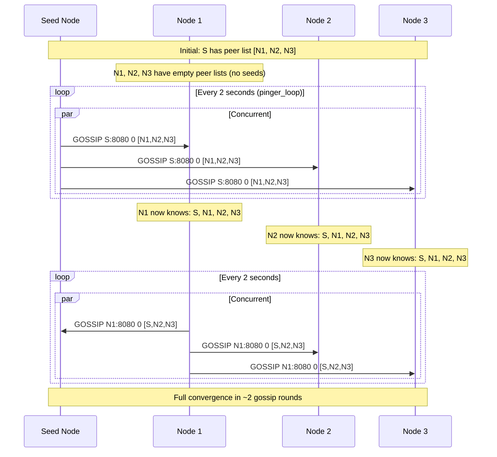
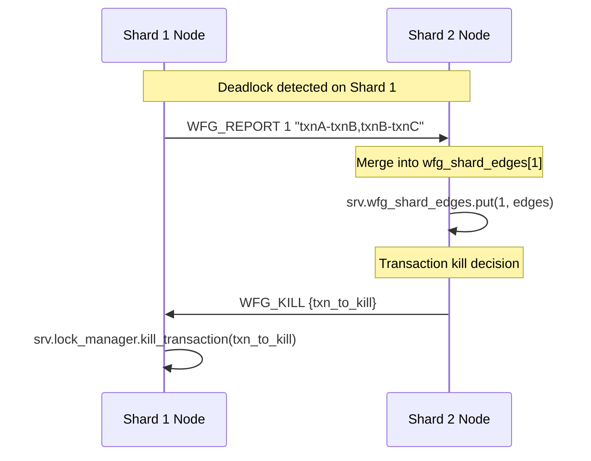

# Gossip Protocol — Peer Discovery and Message Routing

## Overview

The `GossipProtocol` in `src/server/gossip.zig` implements a **push-pull gossip** protocol over UDP for peer discovery, with a built-in message router that dispatches Raft, WFG (Wait-For-Graph), and replication messages on top of the same transport.

The gossip layer is the foundational network primitive: every node in a SimpleDB cluster discovers its peers through gossip, and all inter-node control messages travel through it.

**Key design:** The gossip port is always `tcp_port + 1000` (line 31). All gossip and Raft control messages use **UDP** (`std.Io.net.Socket` in `.dgram` mode). WAL replication uses **TCP** (see `replication.zig`). This separation keeps the lightweight control path fast while allowing the high-throughput replication path to manage its own connections.

Source: `src/server/gossip.zig`

---

## Architecture

```
┌──────────────────────────────────────────────────────────────────┐
│  Node A (127.0.0.1:8080)                                         │
│                                                                  │
│  UDP Socket: 127.0.0.1:9080  ← gossip_port = tcp_port + 1000   │
│                                                                  │
│  ┌─────────────────┐                                            │
│  │ listener_loop   │ ← receives all incoming UDP datagrams      │
│  └────────┬────────┘                                            │
│           │ dispatch                                             │
│  ┌────────┼────────┬─────────┐                                  │
│  │        │        │         │                                   │
│  ▼        ▼        ▼         ▼                                   │
│  GOSSIP  RAFT_*  WFG_KILL  WFG_REPORT                           │
│ (peer    (raft.zig) (lock_mgr) (wfg_shard_edges)                │
│  update)                                                    │
│                                                                  │
│  ┌─────────────────┐                                            │
│  │ pinger_loop     │ → every 2s: broadcasts GOSSIP to all peers │
│  └─────────────────┘                                            │
└──────────────────────────────────────────────────────────────────┘
         │ UDP
         ▼
┌─────────────────────┐
│  Node B (127.0.0.1:8081)   [same architecture]
│  UDP Socket: 127.0.0.1:9081
└─────────────────────┘
```

---

## Gossip Message Format

### Peer Advertisement — `GOSSIP`

**Broadcast format (line 216):**

```
GOSSIP {sender_address} {shard_id} {peer1,peer2,...}
```

Example:

```
GOSSIP 127.0.0.1:8080 0 127.0.0.1:8081,127.0.0.1:8082
```

The message contains:
1. `sender_address` — the sender's TCP server address
2. `shard_id` — which shard this node belongs to (for sharded deployments)
3. A comma-separated list of all TCP addresses known to the sender

The receiver:
1. Extracts `sender` and `sender_shard_id`, calls `update_peer_with_shard` (line 190)
2. Iterates over the comma-separated peer list, calls `update_peer_with_shard` for each (lines 192–199)
3. Skips its own address (line 196)

**Anti-entropy:** Each gossip message carries the sender's full peer list. This means information spreads in O(log n) rounds in a connected cluster, regardless of network topology. Any node that has a partial view will eventually converge to the full cluster view.

---

## Peer State — `Peer` struct

```zig
pub const Peer = struct {
    address: []const u8,
    last_seen: i64,
    shard_id: u32 = 0,
};
```

- `address` — TCP address string (e.g., `"127.0.0.1:8080"`)
- `last_seen` — Unix timestamp in milliseconds from `time.get_time_ms()`
- `shard_id` — which shard this peer belongs to (0 if unspecified)

Peer state is stored in a `std.StringHashMap(Peer)`. Memory ownership: the map owns the key string (`address`) and the `Peer` struct; both are heap-allocated on insertion.

---

## Background Loops

### `listener_loop` — UDP receiver

**Source:** `src/server/gossip.zig:121–201`

Runs in a dedicated thread (line 75). Receives UDP datagrams and dispatches:

| Prefix | Handler | Action |
|--------|---------|--------|
| `GOSSIP` | line 184 | Update peer view |
| `RAFT_*` | line 132 | Forward to `raft.handle_message()` |
| `WFG_KILL` | line 141 | `srv.lock_manager.kill_transaction(txn_id)` |
| `WFG_REPORT` | line 153 | Merge `wfg_shard_edges` from remote shard |

The listener uses a fixed 4096-byte buffer (`buf: [4096]u8`, line 122). Messages longer than 4096 bytes are silently truncated; this is acceptable since all control messages are well under this limit.

### `pinger_loop` — Gossip broadcaster

**Source:** `src/server/gossip.zig:203–243`

Runs every **2 seconds** (line 205). For each active peer:

1. Builds the gossip message: `GOSSIP {addr} {shard_id} {peer1,peer2,...}`
2. Sends it to the peer's gossip port (`tcp_port + 1000`, line 238)

Active peers are determined by `get_all_peers` — only peers with `last_seen` within **15 seconds** (15000ms) are included in the broadcast list (line 254) and in outgoing messages.

---

## Peer Filtering

### `get_all_peers` — All recently-seen peers

**Source:** `src/server/gossip.zig:246–259`

```zig
if (now - peer.last_seen < 15000) {
    const tcp_addr = try self.allocator.dupe(u8, peer.address);
    try list.append(self.allocator, tcp_addr);
}
```

Returns a list of peers that have been seen in the last 15 seconds. The caller is responsible for freeing the duplicated strings.

### `get_active_peers` — Peers in the same shard

**Source:** `src/server/gossip.zig:261–263`

```zig
pub fn get_active_peers(self: *GossipProtocol, list: *std.ArrayList([]const u8)) !void {
    try self.get_shard_peers(self.shard_id, list);
}
```

This is the function called by Raft's `election_loop` and `append_entries_loop`. It returns only peers in the same shard, so Raft elections and append-entries happen within a shard.

### `get_shard_peers` — Shard-scoped peer list

**Source:** `src/server/gossip.zig:265–279`

```zig
if (now - peer.last_seen < 15000 and peer.shard_id == target_shard) {
    // include
}
```

---

## Shard-Aware Routing

The `shard_id` field on `Peer` enables sharded deployments where Raft groups are per-shard, not global. The gossip protocol propagates shard membership:

```zig
pub fn update_peer_with_shard(self: *GossipProtocol, address: []const u8, s_id: u32) void {
    // ... update or insert peer with shard_id = s_id
}
```

When a node receives a `GOSSIP` message, it records the sender's shard_id and all the peers listed in the message (line 197). This means that within a few gossip rounds, every node knows which shard every other node belongs to.

---

## Mermaid Sequence — Gossip Convergence



---

## Mermaid Sequence — WFG Cross-Shard Reporting



---

## Failure Detection

The gossip protocol doubles as a **failure detector** via the `last_seen` timestamp:

- A peer is considered **alive** if `now - last_seen < 15000` ms (15 seconds)
- A peer is considered **dead** if no gossip message has been received for ≥ 15 seconds
- The Raft `election_loop` uses `get_active_peers` to find the current cluster membership

**Trade-off:** A 15-second failure detection window means a failed node will not be excluded from quorum calculations for up to 15 seconds. This is a deliberate trade-off: a short window causes spurious leader elections during transient network delays; a long window delays failure detection. 15 seconds is reasonable for a LAN deployment.

---

## Thread Safety

All peer map operations are protected by `self.mutex: std.Io.Mutex`:
- `listener_loop` writes to the peer map (concurrent with reader)
- `get_all_peers`, `get_shard_peers`, `get_active_peers` read the peer map
- `update_peer_with_shard` writes to the peer map
- `pinger_loop` calls `get_all_peers` (read)

The mutex is a `std.Io.Mutex` (async-aware) rather than `std.Thread.Mutex` because the I/O model uses async fibers.

---

## Trade-offs

| Aspect | Decision | Trade-off |
|--------|----------|-----------|
| **Transport** | UDP for gossip, TCP for replication | UDP avoids connection overhead; TCP ensures delivery for replication |
| **Port offset** | `gossip_port = tcp_port + 1000` | Fixed offset is simple; assumes no port conflicts |
| **Peer list in message** | Full list on every push | O(n²) total bytes per round but guarantees convergence in 1 hop |
| **Failure detection** | 15-second window | Conservative; tolerates brief network hiccups |
| **No epidemic / random push** | Deterministic push-pull via full list | Simpler; converges in O(log n) rounds like random gossip |
| **No message authentication** | Plain UDP | Suitable for localhost; would need mTLS in production |
| **No sequence numbers / vector clocks** | Pure timestamp-based | Cannot detect message reordering or duplication; acceptable for peer discovery |
| **Shard routing** | Shard ID embedded in gossip message | Requires consistent shard configuration across cluster |
| **4096-byte fixed buffer** | Hard-coded in listener_loop | Sufficient for all control messages; silent truncation if exceeded |

---

## File Reference

| Symbol | File | Line |
|--------|------|------|
| `Peer` struct | `src/server/gossip.zig` | 5 |
| `GossipProtocol` struct | `src/server/gossip.zig` | 11 |
| `GossipProtocol.init` | `src/server/gossip.zig` | 25 |
| `listener_loop` | `src/server/gossip.zig` | 121 |
| `pinger_loop` | `src/server/gossip.zig` | 203 |
| `update_peer_with_shard` | `src/server/gossip.zig` | 79 |
| `broadcast_message` | `src/server/gossip.zig` | 101 |
| `get_all_peers` | `src/server/gossip.zig` | 246 |
| `get_active_peers` | `src/server/gossip.zig` | 261 |
| `get_shard_peers` | `src/server/gossip.zig` | 265 |
