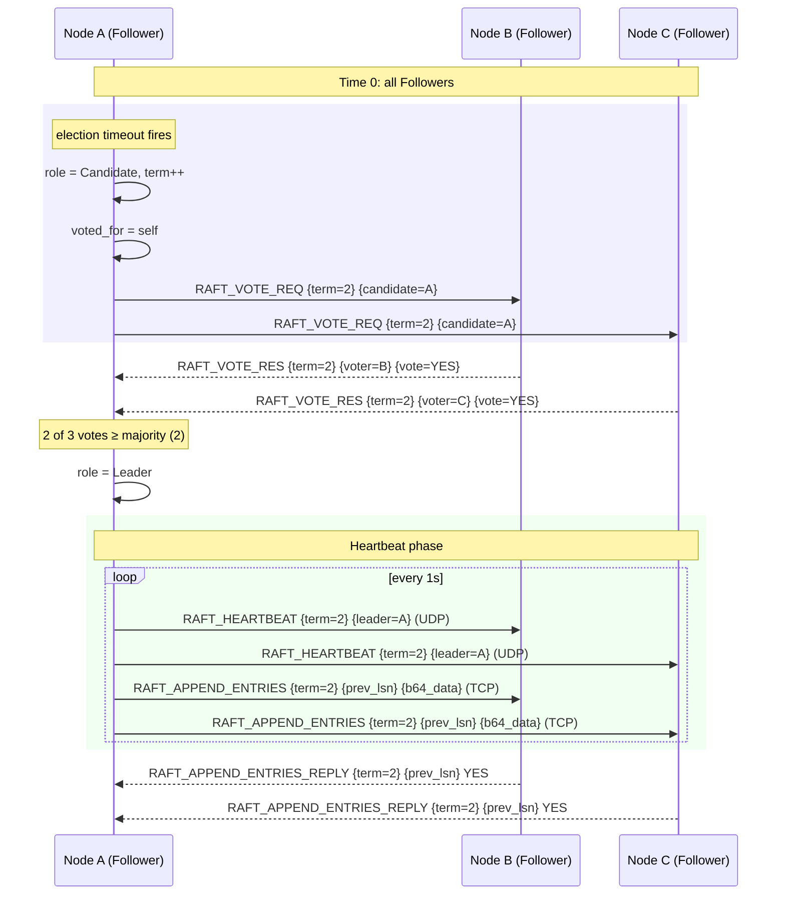
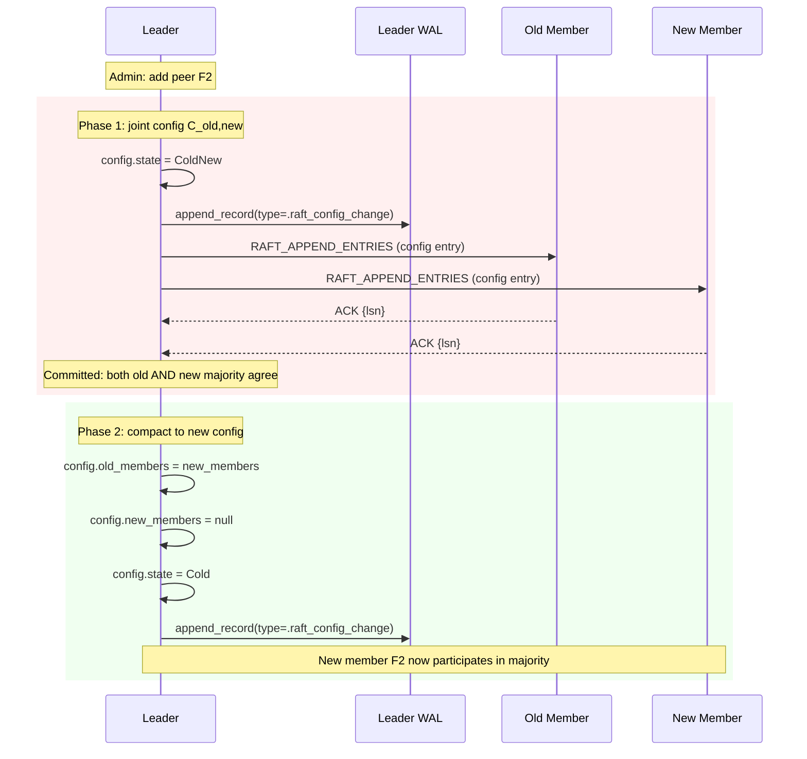

# Raft Consensus — Cluster Leadership and Configuration

## Overview

The `RaftGroup` struct in `src/server/raft.zig` implements a subset of the Raft consensus algorithm (Diego Ongaro & John Ousterhout, 2014) for managing cluster leadership and performing safe configuration changes via joint consensus. It is built on top of the gossip transport layer and is designed for in-process, low-latency cluster coordination.

**What it is NOT:** Raft here does not manage the replication stream directly (see `replication.zig`). Instead, it elects a leader, propagates heartbeats, and encodes configuration-change log entries into the WAL for durability.

Source: `src/server/raft.zig`

---

## Core Data Structures

### `Role` enum

```zig
pub const Role = enum { Follower, Candidate, Leader };
```

### `RaftGroup` struct

Key fields (lines 7–41):

| Field | Type | Purpose |
|-------|------|---------|
| `role` | `Role` | Current node role |
| `current_term` | `u64` | Raft term number |
| `voted_for` | `?[]const u8` | Node voted for in current term |
| `config` | `ClusterConfig` | Cluster membership (old + new for joint consensus) |
| `votes_received_from` | `StringHashMap(void)` | Votes gathered in current election |
| `last_heartbeat_ms` | `atomic(i64)` | Time of last heartbeat received |
| `is_async_replica` | `bool` | If true, skip Raft threads (pure follower) |
| `gossip` | `*GossipProtocol` | Transport layer |

The struct holds a raw `?*anyopaque server` pointer (line 10) which is cast to `*Server` when needed. This avoids a circular import between the Raft module and the Server module.

---

## Leader Election

### Election Timeout — `election_loop`

**Source:** `src/server/raft.zig:204–278`

The election loop runs in a dedicated thread (spawned at line 55). Each iteration:

1. Picks a **randomized timeout** in [1500ms, 3000ms) using a per-instance `DefaultPrng` seeded with `get_time_ms()` (line 205, 208). This randomization is critical to break symmetry and avoid split-brain elections.
2. Sleeps for the timeout.
3. Checks if the node is already a Leader — if so, broadcasts a heartbeat and continues.
4. Computes `time_since_heartbeat`. If it exceeds the random timeout, the node becomes a **Candidate**.

### Becoming a Candidate

When the election timeout fires (lines 233–238):

```zig
self.role = .Candidate;
self.current_term += 1;
self.votes_received_from.clearRetainingCapacity();
self.votes_received_from.put(self.gossip.server_address, {}) catch {};
// votes for itself
self.voted_for = self.allocator.dupe(u8, self.gossip.server_address) catch null;
self.last_heartbeat_ms.store(now, .release);
```

Then, it immediately checks if it won the election via `check_election_won` (line 251). This can happen if `cluster_size == 1` (single-node cluster).

### Vote Request — `RAFT_VOTE_REQ`

If not won outright, the candidate broadcasts `RAFT_VOTE_REQ {term} {candidate_id}` to all active peers via UDP (line 261). Peers handle this in `handle_message` (line 63):

```zig
if (term > self.current_term) {
    self.current_term = term;
    self.role = .Follower;
    self.voted_for = try self.allocator.dupe(u8, candidate_id);
    // ... send RAFT_VOTE_RES YES
}
```

The voter grants a vote only if the incoming term is **strictly greater** than its own term — stale votes from previous terms are rejected.

### Vote Response — `RAFT_VOTE_RES`

When a `RAFT_VOTE_RES YES` is received (line 83–109), the recipient (which must be a Candidate in the same term) adds the sender to `votes_received_from`. If `check_election_won` now returns true, the node transitions to **Leader**.

### `check_election_won`

**Source:** `src/server/raft.zig:181–202`

This is the quorum check. Two cases:

- **Stable config (`Cold`)**: Requires majority of `old_members`.
- **Joint config (`ColdNew`)**: Requires majority of both `old_members` AND majority of `new_members` simultaneously. This is the joint consensus requirement — both old and new majorities must agree.

```zig
if (self.config.state == .ColdNew) {
    // Need majority of new members too
    if (new_votes < (nm.len / 2) + 1) return false;
}
```

---

## Heartbeats and Append Entries — `append_entries_loop`

**Source:** `src/server/raft.zig:280–377`

The leader runs an append-entries loop every 1 second (line 285). For each active peer:

1. Looks up `prev_lsn` from `next_index` map (line 305).
2. Reads WAL entries from `prev_lsn` to `current_lsn` (lines 313–341).
3. Encodes each record as base64 (line 336) to avoid any binary protocol issues over TCP.
4. Sends `RAFT_APPEND_ENTRIES {term} {leader_id} {prev_lsn} 0 {b64_payload}` over a **TCP connection** (lines 344–370).
5. Maintains a connection pool in `server_ptr.raft_connections` to avoid reconnection overhead.

### Append Entries Handling — `handle_message_tcp`

**Source:** `src/server/raft.zig:426–524`

When a follower receives `RAFT_APPEND_ENTRIES`:

1. Parses term, leader_id, prev_lsn, base64 payload.
2. If `term >= self.current_term`:
   - Updates term, becomes Follower
   - Sets `server.leader_address`, `is_replica = true`
   - Writes base64-decoded WAL entry to local WAL
   - Advances `lm.global_lsn` and `lm.current_offset`
   - If `record_type == .logical_insert`: applies to the matching B-tree
   - If `record_type == .raft_config_change`: deserializes and installs the new config
3. Sends back `RAFT_APPEND_ENTRIES_REPLY {term} {prev_lsn} YES|NO`

The `prev_lsn` check provides log consistency: the follower only accepts entries that are contiguous from its current WAL end. Gaps cannot occur because the leader always sends entries starting from the follower's last acknowledged LSN.

### `RAFT_HEARTBEAT`

A lightweight heartbeat (`RAFT_HEARTBEAT {term} {leader_id}`) is also sent over UDP via `broadcast_heartbeat_unlocked` (line 158–179). This is distinct from the TCP `RAFT_APPEND_ENTRIES` which carries actual log data. The heartbeat tells followers "the leader is alive" without the overhead of opening a TCP connection every second.

---

## Configuration Changes — Joint Consensus

**Source:** `src/server/raft.zig:379–424`

Configuration changes use the **joint consensus** algorithm from the Raft paper. The `ClusterConfig` (see `raft_config.md`) has two states:

- `Cold` — stable, single majority of `old_members`
- `ColdNew` — joint configuration, needs majority of both `old_members` and `new_members`

### Adding a peer

```zig
if (std.mem.eql(u8, action, "add")) {
    try new_members.append(self.allocator, try self.allocator.dupe(u8, peer));
}
self.config = .{
    .old_members = new_old,
    .new_members = try new_members.toOwnedSlice(self.allocator),
    .state = .ColdNew,
};
```

The leader appends a `raft_config_change` record to the WAL (lines 417–423) encoding the new config. Once this record is replicated and committed, the joint config is installed. A subsequent step (not yet implemented) would compact the joint config to the new stable config.

### Removing a peer

Removal is handled by rebuilding `old_members` without the departing peer (lines 391–396). The leader can remove itself, which results in a cluster shrink.

### Trade-off

Joint consensus is safe but requires **two rounds of majority agreement** for every configuration change. For SimpleDB's use case (relatively static cluster membership), this is an acceptable complexity cost. The alternative (single-server changes without joint consensus) can cause the "brute force" bug where two disjoint majorities can both commit entries.

---

## Mermaid Sequence — Leader Election



---

## Mermaid Sequence — Joint Consensus



---

## Trade-offs

| Aspect | Decision | Trade-off |
|--------|----------|-----------|
| **Election timeout** | Random [1.5s, 3s) | Breaks symmetry; low probability of split-brain |
| **Heartbeat interval** | 1s fixed | Sufficient for a LAN deployment; would need tuning for WAN |
| **Append entries transport** | Raw TCP with connection pool | Low latency; no built-in flow control |
| **Log storage** | Stored in WAL via `lm.append_record` | Durable; config changes survive crashes |
| **Joint consensus** | Both old and new majorities required | Safe during membership changes; 2-phase overhead |
| **Term comparison** | `term >= self.current_term` for heartbeat acceptance | Allows a node to re-acknowledge the same leader after a network partition heals |
| **`is_async_replica`** | No Raft threads spawned | Pure WAL-stream follower doesn't need consensus participation |
| **No pre-vote** | Not implemented | Could prevent disruption by partitioned nodes with stale terms, but adds complexity |
| **No log compaction / snapshotting** | Not implemented | WAL grows indefinitely; would need periodic compaction in production |

---

## File Reference

| Symbol | File | Line |
|--------|------|------|
| `RaftGroup` struct | `src/server/raft.zig` | 7 |
| `Role` enum | `src/server/raft.zig` | 5 |
| `election_loop` | `src/server/raft.zig` | 204 |
| `append_entries_loop` | `src/server/raft.zig` | 280 |
| `handle_message` | `src/server/raft.zig` | 59 |
| `handle_message_tcp` | `src/server/raft.zig` | 426 |
| `handle_config_update` | `src/server/raft.zig` | 379 |
| `check_election_won` | `src/server/raft.zig` | 181 |
| `broadcast_heartbeat_unlocked` | `src/server/raft.zig` | 158 |
| `send_to_peer` | `src/server/raft.zig` | 143 |
| `ClusterConfig` | `src/server/raft_config.zig` | 8 |
