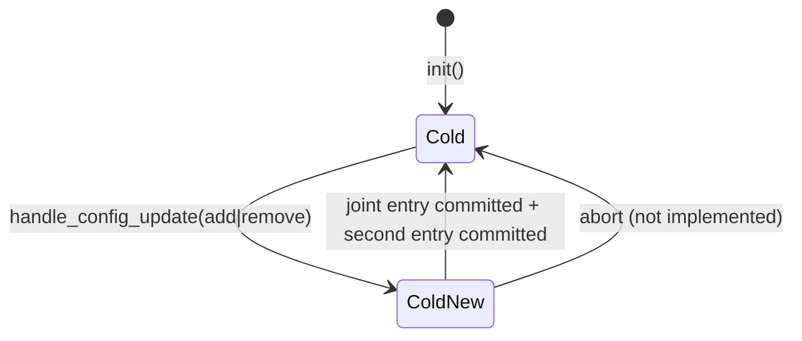
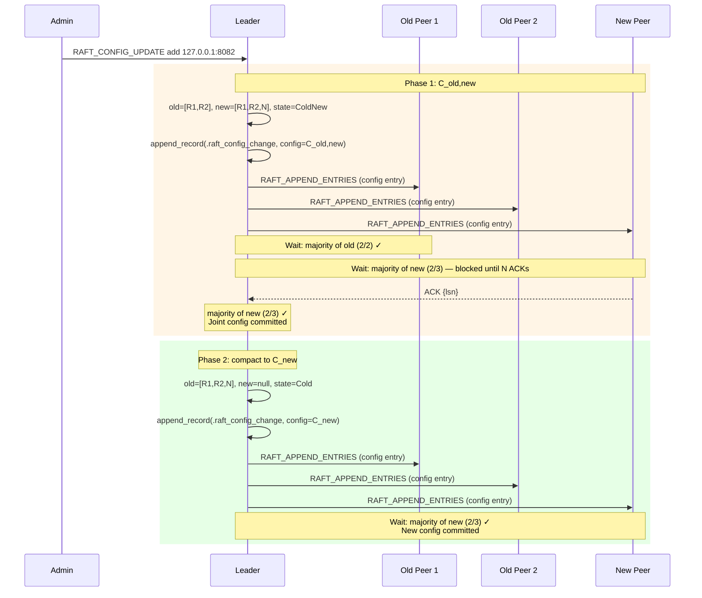

# Raft Cluster Configuration — Joint Consensus State

## Overview

The `ClusterConfig` struct (`src/server/raft_config.zig`) encapsulates Raft's cluster membership information and is the central data structure for the joint consensus protocol. It is serializable so that configuration changes can be stored durably in the WAL, making configuration changes crash-safe.

Source: `src/server/raft_config.zig`

---

## Data Structures

### `ClusterState` enum

```zig
pub const ClusterState = enum {
    Cold,     // Stable single-configuration majority
    ColdNew,  // Joint consensus: two majorities required
};
```

- **`Cold`** — The cluster is in a stable state. Quorum requires a simple majority of `old_members`.
- **`ColdNew`** — A configuration change is in progress. Both the old and new majorities must independently agree for entries to be committed.

### `ClusterConfig` struct

```zig
pub const ClusterConfig = struct {
    old_members: [][]const u8,   // e.g. ["127.0.0.1:8080", "127.0.0.1:8081"]
    new_members: ?[][]const u8,  // null in Cold; populated in ColdNew
    state: ClusterState,
};
```

| Field | Meaning |
|-------|---------|
| `old_members` | The current committed cluster membership |
| `new_members` | The proposed new membership (only during joint consensus) |
| `state` | `Cold` or `ColdNew` |

**Note on allocation:** Both `old_members` and `new_members` are heap-allocated slices of heap-allocated strings. All memory must be freed via `deinit`, which iterates and frees each string, then the outer slice.

---

## Serialization Format

`ClusterConfig` is serialized to a binary format suitable for WAL storage. This allows configuration changes to survive server restarts — when the WAL is replayed, the correct config is restored.

### Binary Layout

```
[1 byte]   state (0 = Cold, 1 = ColdNew)
[4 bytes]  old_members count (little-endian u32)
  For each old_member:
    [4 bytes]  length of member string
    [N bytes]  member string bytes
[4 bytes]  new_members count (0 = null, N > 0 = present)
  For each new_member (only if count > 0):
    [4 bytes]  length of member string
    [N bytes]  member string bytes
```

**Source:** `serialize` at line 25, `deserialize` at line 55.

### Serialization — `serialize`

```zig
pub fn serialize(self: *const ClusterConfig, allocator: std.mem.Allocator) ![]u8 {
    var out = std.ArrayList(u8).empty;
    try out.append(allocator, @intFromEnum(self.state));
    // ... encode old_members count, then each member
    // ... encode new_members count, then each member
    return try out.toOwnedSlice(allocator);
}
```

The function allocates one big `[]u8` slice and returns it to the caller (who is responsible for freeing it).

### Deserialization — `deserialize`

```zig
pub fn deserialize(allocator: std.mem.Allocator, data: []const u8) !ClusterConfig {
    var offset: usize = 0;
    const state: ClusterState = @enumFromInt(data[offset]);
    offset += 1;
    // ... read old_members count, allocate, read each string
    // ... read new_members count, allocate if non-zero, read each string
    return ClusterConfig{ .old_members = old_members.?, .new_members = new_members, .state = state };
}
```

The deserializer uses `errdefer` cleanup (lines 71–79) to free any partially-allocated member strings if an `EndOfStream` error occurs mid-deserialization.

### Clone — `clone`

```zig
pub fn clone(self: *const ClusterConfig, allocator: std.mem.Allocator) !ClusterConfig {
    var new_old = try allocator.alloc([]const u8, self.old_members.len);
    for (self.old_members, 0..) |m, i| new_old[i] = try allocator.dupe(u8, m);
    // ... same for new_members
    return ClusterConfig{ .old_members = new_old, .new_members = new_new, .state = self.state };
}
```

Clone is used in `handle_config_update` (`raft.zig:402`) to preserve the old config before installing a new one, allowing a rollback if needed.

---

## Joint Consensus Workflow

Joint consensus requires a **two-phase** commit of configuration changes:

### Phase 1: Enter `ColdNew`

When a configuration change is initiated (`raft.zig:410–414`):

```
old_members = current_members (unchanged)
new_members = current_members ∪ {new_node}  (or current_members \ {removed node})
state       = ColdNew
```

The new config is written to the WAL as a `raft_config_change` record and replicated to a majority of **both** old and new members.

### Phase 2: Compact to `Cold`

Once the joint config entry is committed, the leader writes a second config entry that removes `new_members` from the structure:

```
old_members = new_members
new_members = null
state       = Cold
```

After this second entry is committed, only the new majority is needed for future operations.

### Quorum Check — `check_election_won`

**Source:** `src/server/raft.zig:181–202`

The quorum check enforces the joint consensus invariant:

```zig
// Phase 1: need majority of old members
if (old_votes < (self.config.old_members.len / 2) + 1) return false;

// Phase 2 (if joint config active): also need majority of new members
if (self.config.state == .ColdNew) {
    if (new_votes < (nm.len / 2) + 1) return false;
}
```

During `ColdNew`, **both** conditions must be satisfied. This prevents a partition from forming a majority in either the old or new configuration independently.

---

## Mermaid State Diagram — Configuration Lifecycle



---

## Mermaid Sequence — Adding a Node via Joint Consensus



---

## Trade-offs

| Aspect | Decision | Trade-off |
|--------|----------|-----------|
| **Serialization format** | Manual length-prefixed binary | No schema evolution — adding fields breaks wire format; acceptable for internal use |
| **Dual-majority requirement** | Both old and new majorities in `ColdNew` | Prevents the "brute force" bug; requires 2-phase coordination |
| **No rollback** | Once `ColdNew` committed, no undo path | Simpler code; joint consensus already provides safety |
| **No learner support** | New nodes must vote to reach majority | Can cause availability gaps during membership changes |
| **In-memory `old_members`** | Rebuilt from config each time | Requires careful memory management; clone/deinit on every update |
| **Error handling in deserialize** | Partial rollback via `errdefer` | Correct for `EndOfStream`; other errors may leak |
| **Member addresses** | Raw TCP address strings (`"127.0.0.1:8080"`) | No DNS names; fine for fixed static clusters |

---

## File Reference

| Symbol | File | Line |
|--------|------|------|
| `ClusterState` enum | `src/server/raft_config.zig` | 3 |
| `ClusterConfig` struct | `src/server/raft_config.zig` | 8 |
| `ClusterConfig.serialize` | `src/server/raft_config.zig` | 25 |
| `ClusterConfig.deserialize` | `src/server/raft_config.zig` | 55 |
| `ClusterConfig.clone` | `src/server/raft_config.zig` | 13 |
| `ClusterConfig.deinit` | `src/server/raft_config.zig` | 121 |
| `check_election_won` (joint quorum) | `src/server/raft.zig` | 192–199 |
| `handle_config_update` | `src/server/raft.zig` | 379 |
