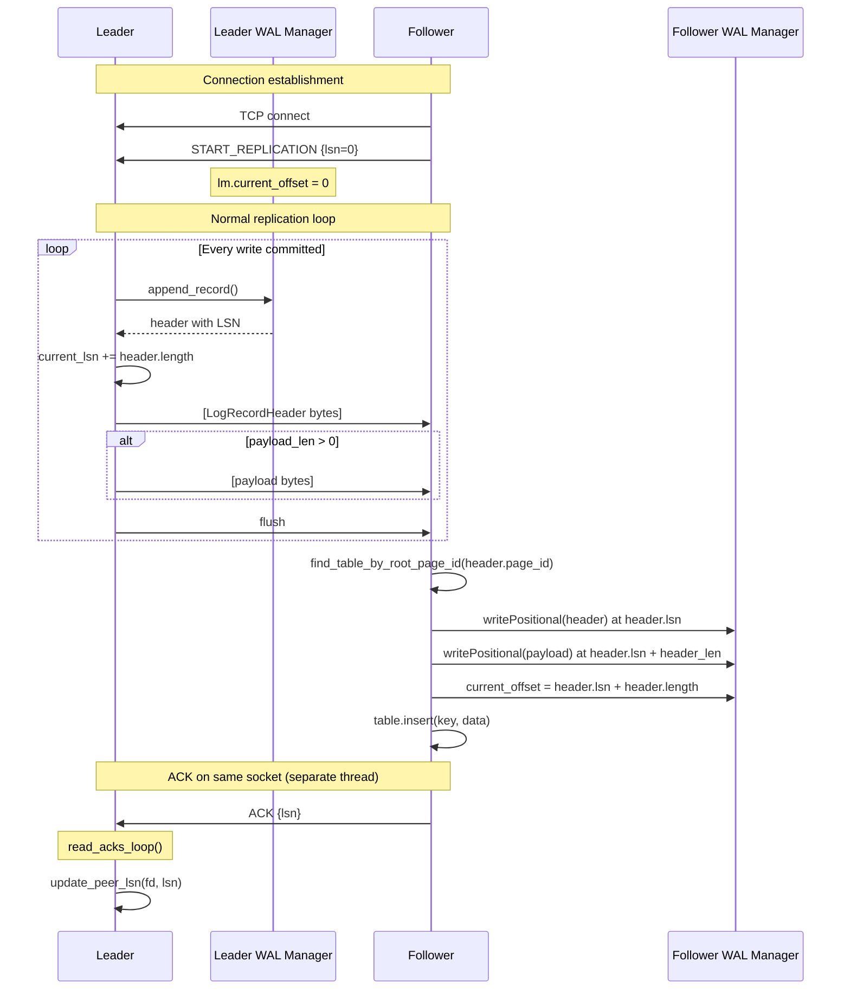

# Replication — Leader-Follower WAL Streaming

## Overview

SimpleDB implements leader-follower replication by streaming Write-Ahead Log (WAL) records over TCP from a leader node to one or more follower replicas. The replication model is **asynchronous** and **log-based**: the leader accepts client writes, durability is guaranteed via the local WAL, and followers receive a stream of WAL records that they replay locally.

The replication layer has two sides:

| Side | Function | Entry point |
|------|----------|-------------|
| Leader | Streams WAL records to each follower | `serve_replication_stream` |
| Follower | Connects to leader, receives and replays records | `connect_and_replicate` |

Source: `src/server/replication.zig`

---

## Architecture

```
┌─────────────────────────────────────────────────────┐
│  Leader (src/server/server.zig)                     │
│                                                     │
│  ┌──────────────┐    TCP stream    ┌────────────┐ │
│  │ WAL Manager   │ ───────────────▶│ Follower(s) │ │
│  │ (wal.zig)     │  serve_replication│            │ │
│  └──────────────┘  _stream()        └────────────┘ │
│                         ▲                          │
│                    ack thread                       │
│               read_acks_loop() ◀──── ACK lines    │
└─────────────────────────────────────────────────────┘
```

**Design decision:** A single TCP connection carries the WAL stream in one direction; acknowledgements flow back on the same socket but are read in a completely separate detached thread using raw POSIX `read(2)` (line 181). This avoids Zig's `std.Io` interface complexities with concurrent bidirectional I/O on one stream.

---

## Leader Side — `serve_replication_stream`

**Source:** `src/server/replication.zig:8–80`

The leader runs one replication stream per connected follower. The function is called once per incoming follower connection.

### Flow

```
serve_replication_stream(server, stream, start_lsn)
  └─ spawn read_acks_loop(server, stream, fd) [detached thread]
  └─ loop:
       ├─ wait for lm.global_lsn to advance past current_lsn
       ├─ read LogRecordHeader from WAL at current_lsn
       ├─ send header bytes over TCP
       ├─ if payload_len > 0: read & send payload bytes
       ├─ flush writer
       └─ advance current_lsn += header.length
```

### Record selection

Only certain `LogRecordType` values are transmitted over the replication stream. At line 142–160, the follower applies records based on `header.record_type`:

- `.logical_insert` → find table by `root_page_id`, insert key+data
- `.logical_delete` → find table by `root_page_id`, delete key
- Other record types (e.g., page flush, checkpoint) are transmitted over the wire (so followers maintain a full WAL) but are **not applied** to the table store on the follower. Only logically-meaningful mutations are replayed.

### Wait strategy (leader back-pressure)

Lines 22–29 implement a simple back-pressure mechanism:

```zig
if (current_lsn >= lm.global_lsn.load(.acquire)) {
    lm.mutex.lockUncancelable(server.io);
    if (current_lsn >= lm.current_offset) {
        lm.cond.waitUncancelable(server.io, &lm.mutex);  // block until WAL grows
    }
    lm.mutex.unlock(server.io);
    continue;
}
```

The leader spins until the WAL has advanced past the LSN it is trying to send. This prevents sending records faster than they are written, though it is a busy-wait with a condition variable.

### Starting LSN

The follower tells the leader where to start via `START_REPLICATION {lsn}\r\n` (line 107). This allows a rejoining follower to resume from the last LSN it acknowledged, minimizing the amount of data transferred on a reconnect.

---

## Follower Side — `connect_and_replicate`

**Source:** `src/server/replication.zig:82–162`

The follower initiates a TCP connection to `leader_address` and then:

1. Sends `START_REPLICATION {current_lsn}` (line 107) — its current WAL end offset
2. Loops reading `LogRecordHeader` + payload from the leader
3. For each record:
   - Writes the raw bytes to its local WAL at the record's LSN (lines 133–137)
   - Advances `lm.current_offset` and `lm.global_lsn` (lines 137–138)
   - If logical record: applies to the matching table via `root_page_id` lookup

### Table matching via `root_page_id`

The `header.page_id` field is the `root_page_id` of the B-tree that owns the key being mutated. The follower resolves this to a `*Table` via `find_table_by_root_page_id` (lines 164–172):

```zig
fn find_table_by_root_page_id(catalog: *Catalog, root_page_id: u32) ?*Table {
    var it = catalog.tables.iterator();
    while (it.next()) |kv| {
        if (kv.value_ptr.*.btree.root_page_id == root_page_id) return kv.value_ptr.*;
    }
    return null;
}
```

This lookup works because the follower's catalog is pre-loaded with system tables (loaded from the catalog's own B-tree root page 0). When `header.page_id == 0`, the follower calls `server.catalog.load_sys_tables()` (lines 149, 157) to refresh the in-memory catalog.

### Key extraction from payload

For `logical_insert` and `logical_delete` records, the key is stored as the first 8 bytes of the payload, little-endian:

```zig
const key = std.mem.readInt(u64, payload_buf[0..8][0..8], .little);
const data = payload_buf[8..];
```

The value/data portion is whatever remains after the key — the table's schema determines its layout.

---

## Acknowledgement Loop — `read_acks_loop`

**Source:** `src/server/replication.zig:174–203`

This runs in a **detached thread** (line 17) per follower. It reads line-delimited messages from the TCP socket and handles:

```
ACK {lsn}
```

When a valid ACK is received, `server.update_peer_lsn(fd, lsn)` is called to record how far the follower has durable WAL. The leader uses this to track replication lag per follower (the server module's `update_peer_lsn` is called at line 199).

**Trade-off:** Using raw `read(2)` in a separate thread on the same socket as the writer is unconventional. A cleaner design would use async I/O or a dedicated acknowledgement channel. This approach was chosen to sidestep Zig's `std.Io` complexities with concurrent duplex streams.

---

## Mermaid Sequence — Replication Flow



---

## Trade-offs

| Aspect | Decision | Trade-off |
|--------|----------|-----------|
| **Protocol** | Custom TCP streaming, not gRPC/HTTP | Avoids dependency overhead; requires custom framing |
| **Ack channel** | Same TCP socket, separate thread reading raw POSIX | Avoids Zig Io duplex complexity; fragile with stream boundaries |
| **Record filtering** | Only logical records applied on follower | Followers replay WAL but skip page-oriented records — keeps follower state correct without full page image replay |
| **Resumability** | Follower sends `START_REPLICATION {lsn}` | Followers can reconnect without full resync |
| **Back-pressure** | Leader spins on condition variable | Simple but can cause spurious wakeups; a ring-buffer or pipeline approach would be more efficient |
| **Failure model** | Leader failure → manual failover required | No automatic leader election (the Raft layer handles leadership for cluster management, but replication itself is a separate concern) |

---

## Relationship to Raft

The replication layer is **orthogonal to Raft's consensus role**. Raft manages cluster leadership and configuration changes; the replication layer streams WAL data from the elected leader to followers. Specifically:

- **Raft heartbeat** (`RAFT_HEARTBEAT`) carries leadership and term information; it also indirectly triggers `serve_replication_stream` via the connection layer.
- **`RAFT_APPEND_ENTRIES`** in `raft.zig` carries actual WAL records in base64 encoding — this is the proper consensus path. The replication layer (`replication.zig`) is a higher-throughput, unidirectional streaming path that runs separately.
- When a Raft leader steps down or a follower loses contact, the replication stream is expected to be closed by the TCP layer, and the follower transitions back to `is_replica = true`.

---

## File Reference

| Symbol | File | Line |
|--------|------|------|
| `serve_replication_stream` | `src/server/replication.zig` | 8 |
| `connect_and_replicate` | `src/server/replication.zig` | 82 |
| `read_acks_loop` | `src/server/replication.zig` | 174 |
| `find_table_by_root_page_id` | `src/server/replication.zig` | 164 |
| `LogRecordHeader` | `src/storage/wal/log_record.zig` | — |
| `update_peer_lsn` | `src/server/server.zig` | — |
