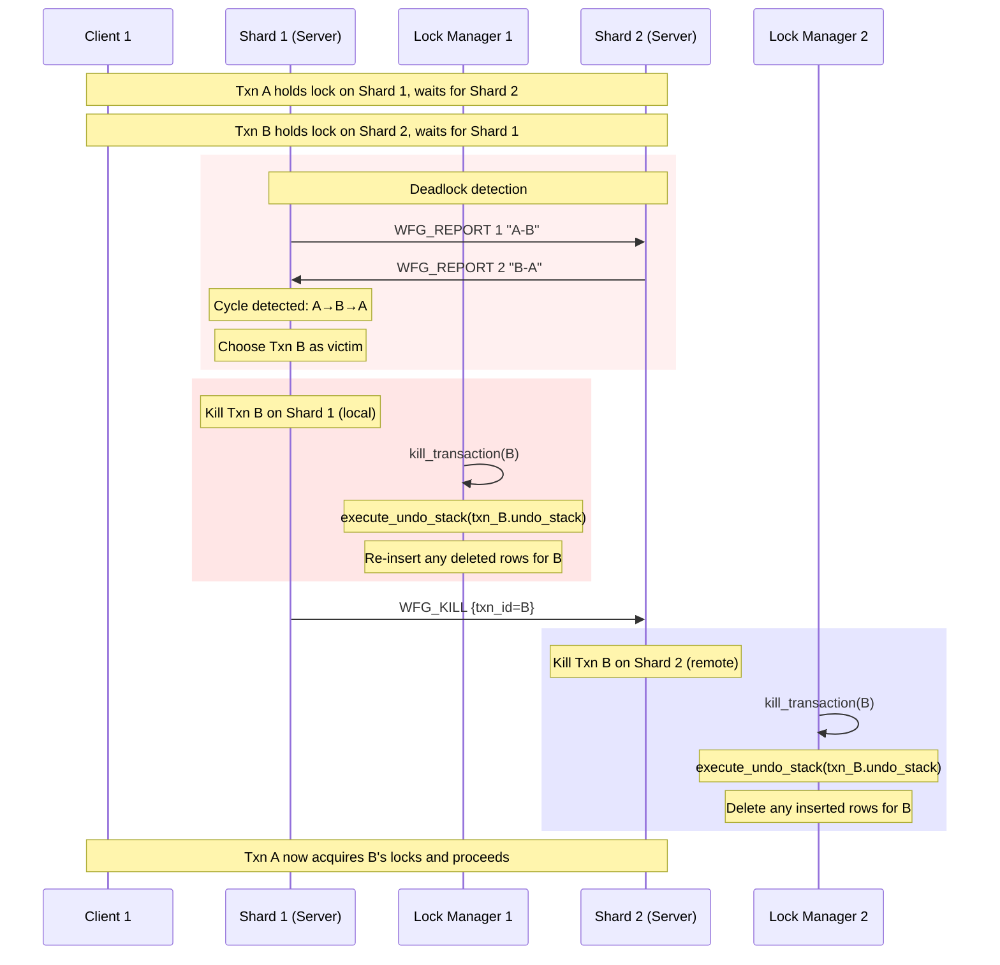
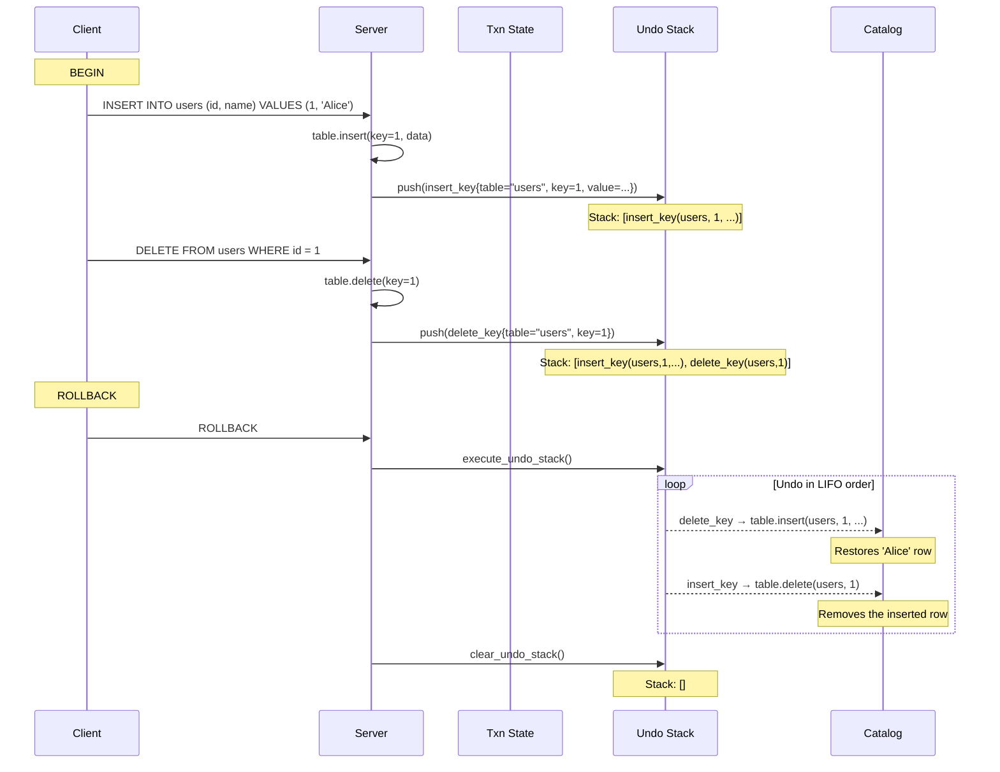

# Undo Protocol — Transaction Rollback

## Overview

The undo protocol in `src/server/undo.zig` provides **logical undo** for aborted or killed transactions. Rather than relying on physical undo (restoring old page images), SimpleDB records a stack of logical operations that can be reversed in order. This is simpler to implement, works correctly with concurrent transactions, and integrates naturally with the B-tree's key-space operations.

The undo mechanism is primarily used for:
1. **Transaction abort** — explicit `ROLLBACK` from a client
2. **Deadlock kill** — a transaction selected by the deadlock detector is killed and must roll back
3. **Distributed abort** — a coordinator node initiates a rollback across shards via gossip (`WFG_KILL`)

Source: `src/server/undo.zig`

---

## Data Structures

### `UndoOp` Union

```zig
pub const UndoOp = union(enum) {
    delete_key: struct { table_name: []const u8, key: u64 },
    insert_key: struct { table_name: []const u8, key: u64, value: []const u8 },
};
```

Each variant captures the information needed to reverse one logical operation:

| Variant | Meaning | Undo action |
|---------|---------|-------------|
| `delete_key` | A row was deleted during this transaction | Re-insert the original row (value stored separately) |
| `insert_key` | A row was inserted during this transaction | Delete the inserted row |

**Why not a `update_key` variant?** The current implementation does not support in-place updates (only insert/delete). When update support is added, a variant capturing `(old_value, new_value)` would be needed.

### Undo Stack

The undo stack is a `std.ArrayList(UndoOp)` associated with each transaction. It is pushed to during statement execution and popped (executed in reverse) during rollback.

---

## Operations

### Recording Undo — Per-Statement

The executor pushes `UndoOp` entries as it executes statements. For example:

- **INSERT**: push `insert_key{ table_name, key, value }` before the insert
- **DELETE**: push `delete_key{ table_name, key }` before the delete (the value must be preserved in the transaction's read set)

This is done at the executor layer, not in `undo.zig`. The `undo.zig` module only provides the stack management and execution primitives.

### Executing Undo — `execute_undo_stack`

**Source:** `src/server/undo.zig:26–53`

```zig
pub fn execute_undo_stack(undo_stack: *std.ArrayList(UndoOp), catalog: *Catalog) void {
    var i: usize = undo_stack.items.len;
    while (i > 0) {
        i -= 1;
        const op = undo_stack.items[i];
        switch (op) {
            .delete_key => |d| {
                if (catalog.get_table(d.table_name)) |table| {
                    table.delete(null, d.key) catch ...;
                }
            },
            .insert_key => |ins| {
                if (catalog.get_table(ins.table_name)) |table| {
                    _ = table.insert(null, ins.key, ins.value) catch ...;
                }
            },
        }
    }
}
```

Key semantics:
- **LIFO order** — iterating from `len-1` down to `0` reverses the chronological order of operations
- **Table lookup at rollback time** — uses `catalog.get_table(table_name)`, not a cached pointer. This means the table must still exist in the catalog when rollback occurs.
- **Errors are logged but not propagated** — if undo fails, the error is printed and execution continues with the next operation. This is a trade-off: a partially-undone transaction is better than a panicked server.
- **Safe for null catalog entries** — if the table was dropped during the transaction, `get_table` returns null and the undo is skipped with a warning.

### Clearing the Stack — `clear_undo_stack`

**Source:** `src/server/undo.zig:12–23`

```zig
pub fn clear_undo_stack(undo_stack: *std.ArrayList(UndoOp), allocator: std.mem.Allocator) void {
    for (undo_stack.items) |op| {
        switch (op) {
            .delete_key => |d| allocator.free(d.table_name),
            .insert_key => |i| {
                allocator.free(i.table_name);
                allocator.free(i.value);  // value was heap-allocated by executor
            },
        }
    }
    undo_stack.clearRetainingCapacity();
}
```

Frees all heap-allocated strings (`table_name`, `value`) in the stack. Uses `clearRetainingCapacity` to preserve the allocated buffer for reuse.

**Important:** `value` in `insert_key` is heap-allocated because the executor copies the inserted data into the undo record so it can be re-inserted if needed. The caller (executor) must have allocated this.

---

## Trigger Points

The undo stack is triggered from multiple places in the system:

### 1. Explicit Client Abort

When a client sends `ROLLBACK`, the server's transaction layer calls `execute_undo_stack` for the transaction's undo stack.

### 2. Deadlock Kill via Gossip

**Source:** `src/server/gossip.zig:141–150`

When a deadlock is detected across shards, one shard's lock manager kills a transaction and broadcasts a `WFG_KILL {txn_id}` message to all other shards:

```zig
if (std.mem.eql(u8, header, "WFG_KILL")) {
    const txn_id = std.fmt.parseInt(u32, txn_str, 10) catch continue;
    if (self.server_ptr) |ptr| {
        const srv = @as(*Server, @ptrCast(@alignCast(ptr)));
        srv.lock_manager.kill_transaction(txn_id);
        // ... kill triggers undo
    }
}
```

`kill_transaction` in the lock manager (`lock_manager.zig`) invokes the transaction's abort path, which calls `execute_undo_stack`.

### 3. WFG Shard Edge Reporting

**Source:** `src/server/gossip.zig:153–182`

Each shard periodically reports its wait-for-graph edges to other shards via `WFG_REPORT`. This enables cross-shard deadlock detection — a deadlock cycle spanning two shards can be detected and broken without a centralized coordinator.

---

## Mermaid Sequence — Deadlock Kill with Distributed Undo



---

## Mermaid Sequence — Explicit Transaction Rollback



---

## Interaction with MVCC

The undo protocol works **orthogonally** to MVCC. In SimpleDB's MVCC implementation (`src/storage/concurrency/mvcc.zig`):

- **Writers** create new versions; readers see the latest committed version.
- The undo stack handles the **logical** dimension: if a transaction inserts a row that conflicts with a deadlock, we delete it.
- The **physical** dimension (old page images) is not needed because the B-tree operations are inherently reversible: `delete` and `insert` are exact inverses.

If a transaction inserts a row and then aborts, MVCC garbage collection will not see the uncommitted row in any case (it has a `txn_id` that is not committed), so no physical cleanup is needed. The undo operation is purely for the case where the transaction state has been made visible (e.g., via dirty reads in the same transaction's scan).

---

## Trade-offs

| Aspect | Decision | Trade-off |
|--------|----------|-----------|
| **Logical undo** | Store operations, not page images | Simpler, smaller undo records; correct with B-tree structure |
| **No update support** | Only insert/delete tracked | Partial updates must be modelled as delete+insert; requires careful executor instrumentation |
| **Value preservation** | `value` heap-allocated in `insert_key` | Memory overhead for large rows; acceptable since rollback is rare |
| **Error handling** | Errors logged, execution continues | Partial undo is better than crashing; may leave DB in inconsistent state |
| **Catalog dependency** | `catalog.get_table` at rollback time | Fails if table was dropped during transaction; a DROP TABLE during an active transaction is dangerous |
| **No nested undo** | Flat stack per transaction | Nested transactions would need a stack of stacks |
| **No distributed snapshot** | Each shard has independent undo | A distributed transaction spanning shards needs coordinator-level compensation |
| **Gossip-based kill** | `WFG_KILL` broadcast | At-least-once delivery; killed transactions may be killed twice (idempotent) |
| **LIFO semantics** | Strict reverse chronological order | Required for correctness; non-LIFO would produce wrong state |
| **Retaining capacity** | `clearRetainingCapacity` | Reuses allocated buffer; avoids repeated heap allocations for active transactions |

---

## File Reference

| Symbol | File | Line |
|--------|------|------|
| `UndoOp` union | `src/server/undo.zig` | 6 |
| `execute_undo_stack` | `src/server/undo.zig` | 26 |
| `clear_undo_stack` | `src/server/undo.zig` | 12 |
| `WFG_KILL` handler | `src/server/gossip.zig` | 141 |
| `WFG_REPORT` handler | `src/server/gossip.zig` | 153 |
| `kill_transaction` | `src/storage/concurrency/lock_manager.zig` | — |
| MVCC integration | `src/storage/concurrency/mvcc.zig` | — |
