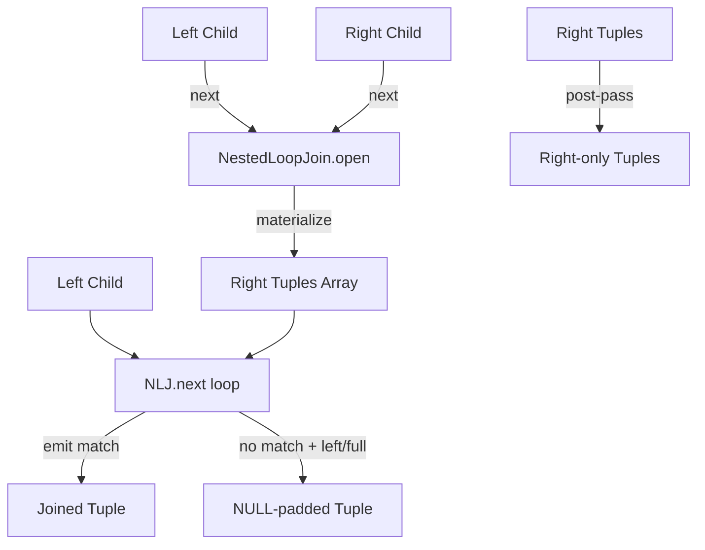
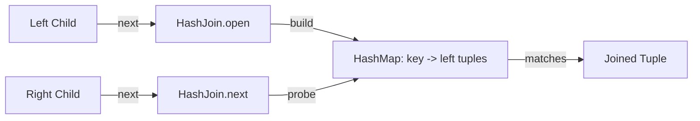
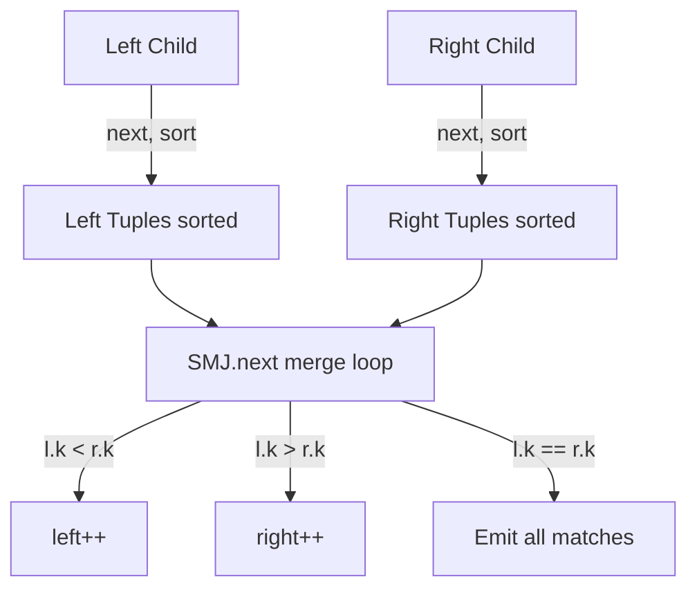
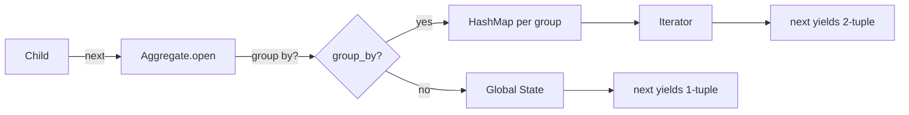
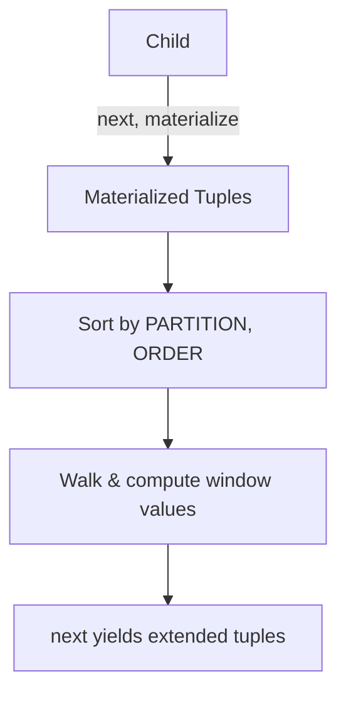
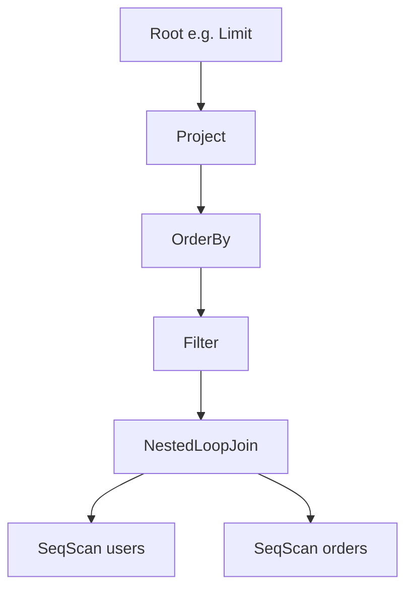

# Executor Implementation

## Overview

The executor (`src/query/executor.zig` and `src/query/executor/*.zig`) runs compiled query plans using the **Volcano (iterator) model**: every operator exposes a three-method interface — `open()`, `next()`, `close()` — and pulls tuples one at a time from its child(ren). The driver invokes `next()` on the root until it returns `null`, collecting tuples for formatting.

## Volcano Iterator Model

```zig
const Executor = union(enum) {
    seq_scan, filter, project, nested_loop_join, hash_join, sort_merge_join,
    aggregate, insert, index_scan, delete, update, order_by, limit,
    in_memory_scan, in_memory_insert, window,
};
```

Each variant stores a pointer to its corresponding `*Executor` struct (e.g., `*SeqScanExecutor`). The union's three methods dispatch on the active variant:

```zig
pub fn open(self: *Executor)   !void { ... }   // per-variant one-liners
pub fn next(self: *Executor)   !?[]ast.Value  { ... }
pub fn close(self: *Executor)  void            { ... }
pub fn explain(self, writer, depth) !void     { pretty-print plan }
```

### Execution Lifecycle

```
┌────────────────────────────────────────────────────┐
│ Client / driver:                                    │
│   root.open();                                      │
│   while (try root.next()) |tuple| { format(tuple) }│
│   root.close();                                      │
└────────────────────────────────────────────────────┘
```

The driver owns the top-level call; each operator owns open/close of its children. Operators are responsible for freeing intermediate tuples they buffer.

## Operator Catalog

### Scan Operators (leaf nodes)

#### SeqScanExecutor (`executor/seq_scan.zig`)

**Algorithm**:
1. `open()`: Calls `table.btree.scan(0, maxInt(u64))` to fetch all RIDs (record IDs) in key order. Each RID is a 64-bit value packing `heap_page_id` (high 32) and `slot_id` (low 16).
2. `next()`: Iterates the RID list; for each RID, decodes page/slot, acquires a shared row lock (if a transaction is active), checks MVCC visibility via the xmin/xmax prefix, and returns the deserialized tuple.
3. **Frame caching**: Maintains a `current_frame` and `current_page_id`. When consecutive RIDs hit the same page, the frame is reused; only on a page change is the old frame unpinned and a new one fetched.

```zig
if (self.current_page_id == null or self.current_page_id.? != heap_page_id) {
    if (self.current_frame) |f| self.table.buffer_manager.unpin_frame(f, false);
    self.current_frame = try self.table.buffer_manager.fetch_frame(heap_page_id);
    self.current_page_id = heap_page_id;
}
```

This is the **frame caching** optimization: a single page read may yield many tuples; only one `fetch_frame` call is needed.

4. MVCC visibility: Each tuple begins with 8 bytes: 4-byte xmin, 4-byte xmax. The `txn_ctx.is_visible(xmin, xmax)` check is applied; without a transaction context, only xmax==0 (not deleted) is accepted.

5. Tuple decoding: `Table.deserialize_tuple` is called; this reinterprets the on-disk row format into an `[]ast.Value` heap-allocated slice. If the table has no schema, the entire payload is returned as a single `varchar` value (legacy mode).

#### IndexScanExecutor (`executor/index_scan.zig`)

**Algorithm**:
1. `open()`: Translates the internal `Condition` (eq/range) into the appropriate index lookup. If a secondary `index_def` is provided and its type is `hash`, only `eq` is supported (returns `error.RangeScanNotSupportedOnHashIndex`). For btree, both `eq` (scan [k,k]) and `range` are issued.
2. `next()`: Same as SeqScan but with a smaller RID list. **No frame caching** here — each RID fetches and immediately unpins its frame. (Trade-off: fewer RIDs in index scans, simpler logic.)
3. The same MVCC visibility check applies.

#### InMemoryScanExecutor (`executor/in_memory_scan.zig`)

**Algorithm**: Trivial cursor over a `std.ArrayList([]ast.Value)` stored in the `InMemoryTable`. `next()` returns a deep copy of each row. Used for temporary result sets, e.g. `WITH cte AS (select) ...`.

### Filter & Project Operators

#### FilterExecutor (`executor/filter.zig`)

**Algorithm**: `next()` calls `child.next()` in a loop; calls `evaluate_expression(expr, tuple, schema)`; if the result is true, returns the tuple, otherwise frees it and continues. This is a **lazy filter** — it does not pre-load all rows.

```zig
while (try self.child.next()) |tuple| {
    if (evaluate_expression(self.expression, tuple, self.schema)) {
        return tuple;
    }
    free_tuple(self.allocator, tuple);
}
```

**Expression evaluation** is implemented in `executor.zig:evaluate_expression`:
- `compare` (column op literal): Resolves column via `resolve_column`, calls `compare_values`.
- `and_expr` (e1 AND e2): Recursive `and` evaluation. Note: `column_compare` and `compare_subquery` are **not handled** here — they are join-specific.

#### ProjectExecutor (`executor/project.zig`)

**Algorithm**: `next()` pulls a tuple from the child, **frees it immediately** (`defer free_tuple`), allocates a new tuple of length `column_indices.len`, and copies the selected columns via `dupe_value` (which deep-copies varchar/json).

```zig
var new_tuple = try self.allocator.alloc(ast.Value, self.column_indices.len);
for (self.column_indices, 0..) |col_idx, out_idx| {
    if (col_idx < tuple.len) {
        new_tuple[out_idx] = try dupe_value(self.allocator, tuple[col_idx]);
    } else {
        new_tuple[out_idx] = .{ .int = 0 }; // Fallback
    }
}
```

`dupe_value` is the **string isolation mechanism** — every operator that returns a tuple to its parent must deep-copy varchar/json values to prevent the parent from reading freed memory.

### Join Operators

#### NestedLoopJoinExecutor (`executor/nested_loop_join.zig`)

**Algorithm**:
1. `open()`: Opens both children. **Materializes the right child** into a `std.ArrayList([]ast.Value)` (with a parallel `right_matched` boolean list). The right child is closed after materialization; its tuples are deep-copied into the array.
2. `next()`: For each left tuple, scans the materialized right list. If `evaluate_join_expression` returns true, mark the right tuple as matched and emit a concatenated tuple.
3. **Outer join handling**: After the right scan completes for a left tuple, if `join_type` is `left` or `full` and no match was found, emits a left tuple with NULL-padded right columns. `right` and `full` joins also post-process: after all left tuples are consumed, scans the right list for any tuples that were never matched, emitting them with NULL-padded left columns.

**Memory cost**: O(|right|) — the entire right side is held in memory.



#### HashJoinExecutor (`executor/hash_join.zig`)

**Algorithm**:
1. `open()`: Opens both children. **Builds a hash table on the left** using `left_join_col_idx` as the key. Each left tuple is deep-copied, keyed on the join column, and grouped into an `ArrayList([]ast.Value)` per key.
2. `next()`: For each right tuple, looks up the right join column in the hash table. If found, emits cross-product of all matching left tuples with this right tuple. Otherwise skips.
3. The `ValueContext` struct (in `executor.zig`) provides hashing and equality over `ast.Value` using Wyhash for memory types and raw bytes for ints/floats.

**Memory cost**: O(|left|) for the hash table plus a constant overhead per bucket.



**Note**: This is a **inner-only** hash join. No LEFT/RIGHT/FULL outer semantics. The plan builder chooses hash join only for inner equi-joins.

#### SortMergeJoinExecutor (`executor/sort_merge_join.zig`)

**Algorithm**:
1. `open()`: Materializes **both** children into arrays, sorts each on the respective join column using `std.mem.sort` with a `lessThanSortMerge` comparator.
2. `next()`: Implements the classic two-pointer merge. Advances `left_idx` or `right_idx` depending on key comparison. When keys match, emits all left-right pairs sharing that key (with `match_right_start_idx` tracking where the right scan started for a given left key).



**Memory cost**: O(|left| + |right|) for both materialized arrays.

### Group & Aggregate Operators

#### AggregateExecutor (`executor/aggregate.zig`)

**Algorithm**:
1. `open()`: Pulls all child tuples. For each, determines the aggregate input (`agg_col_idx` or null for `count(*)`).
2. **With `group_by_col_idx`**: Maintains a `std.HashMap(ast.Value, ast.Value)` keyed on the group-by value, with the running aggregate as the value. Each row updates the group's state.
3. **Without `group_by`**: A single `global_agg` value is updated.
4. Initial aggregate states: `count`/`sum` start at 0, `min`/`max` start at null (then pick the first value), `avg` is initialized to float 0 (though the avg calculation appears incomplete — see the empty `avg` branch in `update_agg`).
5. `next()`: For grouped, iterates the hash map and emits `(group_key, agg_value)` pairs. For global, emits a single tuple with the aggregate.

**`update_agg` state transitions**:
- `count`: `state.int += 1`
- `sum`: Promotes int to float if a float value is added.
- `min`/`max`: Replaces state if the new value is less/greater.
- `avg`: Currently a no-op — average is not computed.



**String duplication caveat**: `min`/`max` allocate a new value when replacing state but do not free the previous state — there is a known leak for varchar aggregates. This is acknowledged in the source comment.

#### WindowExecutor (`executor/window.zig`)

**Algorithm**:
1. `open()`: **Materializes all child tuples** into an `ArrayListUnmanaged`. Then for each window function expression, **re-sorts** the materialized list using a sort context with `part_idx` and `order_idx` and `is_desc` flag.
2. Walks the sorted list, computing the window value for each tuple: `row_number` increments per partition, `rank` resets to `row_number` when the order column value changes, `sum` accumulates an int/signed_int column.
3. Writes each window function's result into a **new column slot** appended to each tuple (so the output tuple length = input length + window_functions.len).
4. `next()`: Returns each materialized tuple, deep-copied.



### Ordering, Limiting

#### OrderByExecutor (`executor/order_by.zig`)

**Algorithm**:
1. `open()`: Opens the child but does **not** pull rows.
2. First `next()`: Materializes the entire child stream into an `ArrayList([]ast.Value)`, resolves column indices, then sorts in-place using `std.mem.sort` with a multi-key comparator (`SortContext.lessThan`).
3. Subsequent `next()`: Returns tuples in sorted order.
4. `close()`: Frees the remaining tail of the buffer (tuples past `current_idx`) and the buffer itself.

The order-by sort is a **blocking operator** — it must consume the child entirely before yielding its first tuple.

#### LimitExecutor (`executor/limit.zig`)

**Algorithm**: A **stateful skip-and-count** filter.
- `open()`: Resets `count` and `skipped` counters.
- `next()`: First skips `offset` tuples (calling `child.next()` and freeing each). Then yields up to `limit` tuples. If neither `offset` nor `limit` is set, acts as a passthrough.

```zig
while (self.skipped < off) {
    if (try self.child.next()) |tuple| {
        free_tuple(self.allocator, tuple);
        self.skipped += 1;
    } else return null;
}
if (count >= limit) return null;
```

### Mutation Operators

#### InsertExecutor (`executor/insert.zig`)

**Algorithm**: **One-shot** mutation. `open()` resets an `executed` flag. `next()` calls `table.insert` with the literal values and sets `executed = true` so subsequent `next()` calls return null. No tuple is yielded.

For schema-less (legacy) tables: requires exactly two values (key + value varchar). For typed tables: requires the first value to be `int` (primary key).

#### DeleteExecutor (`executor/delete.zig`)

**Algorithm**:
1. `open()`: Opens the child (which must produce the candidate rows to delete).
2. `next()`: Iterates child tuples; for each, extracts the primary key (tuple[0].int) and calls `table.delete`. Returns no tuples — this is a side-effecting operator.

**Note**: The child is expected to have already filtered rows via a Filter operator above it.

#### UpdateExecutor (`executor/update.zig`)

**Algorithm**:
1. `open()`: Opens the child.
2. `next()`: For each child tuple, resolves the column index, builds a new tuple with the target column replaced, serializes it, deletes the old row by primary key, and inserts the new row. Returns no tuples.

This is implemented as **delete + insert** under the hood rather than in-place mutation.

#### InMemoryInsertExecutor (`executor/in_memory_insert.zig`)

**Algorithm**: Materializes child tuples and appends each to an `InMemoryTable`. Yields a single `(int inserted_count)` tuple after consumption.

## Frame Caching Optimizations

The buffer manager caches pinned frames per the cache eviction policy (LRU/K, see `buffer_manager.md`). The executor adds two specific optimizations on top:

### SeqScan Page Pinning

`SeqScanExecutor` keeps a single `current_frame` pointer and only refetches when `current_page_id` changes:

```zig
if (self.current_page_id == null or self.current_page_id.? != heap_page_id) {
    if (self.current_frame) |f| self.table.buffer_manager.unpin_frame(f, false);
    self.current_frame = try self.table.buffer_manager.fetch_frame(heap_page_id);
    self.current_page_id = heap_page_id;
}
```

This avoids a per-tuple `fetch_frame`/`unpin_frame` round-trip when many consecutive tuples share a page. `IndexScanExecutor` deliberately does **not** cache frames because index lookups are typically more sparse across pages.

### Materialized Buffering

Operators that need to consume the entire child (`NestedLoopJoin`, `HashJoin`, `SortMergeJoin`, `Aggregate`, `OrderBy`, `Window`) materialize all child tuples at `open()`. The deep-copies (via `dupe_value`) ensure the buffer survives past the child's `close()`.

## Data Type Casting

The executor supports **implicit type promotion only in the `sum` aggregate**:

```zig
.sum => {
    switch (state.*) {
        .int => |s_int| {
            switch (val) {
                .int => |v_int| state.int += v_int,
                .signed_int => |v_sint| state.int +|= @bitCast(v_sint),
                .float => |v_float| state.* = .{ .float = @as(f64, @floatFromInt(s_int)) + v_float },
                else => {},
            }
        },
        .float => {
            switch (val) {
                .int => |v_int| state.float += @as(f64, @floatFromInt(v_int)),
                .signed_int => |v_sint| state.float += @as(f64, @floatFromInt(v_sint)),
                .float => |v_float| state.float += v_float,
                else => {},
            }
        },
    }
},
```

Once the state becomes a `float`, it stays a float. Otherwise, all other operators require **type match**:

```zig
// compare_values
if (@as(ast.ValueType, lhs) != @as(ast.ValueType, rhs)) return false;
```

So `WHERE int_col = '5'` returns no rows because `int` ≠ `varchar`. JSON supports only `eq`/`neq`; bool supports only `eq`/`neq`.

## How Operators Compose

The query planner (see `parser.zig`) builds an `Executor` plan by composing operators from leaves to root. The composition is **demand-driven**: `root.next()` recursively pulls from children.



**Example: `SELECT name FROM users WHERE age > 30 ORDER BY name LIMIT 10`**

```zig
var root: Executor = .{ .limit = &LimitExecutor{
    .child = &Executor{ .project = &ProjectExecutor{
        .child = &Executor{ .order_by = &OrderByExecutor{
            .child = &Executor{ .filter = &FilterExecutor{
                .child = &Executor{ .seq_scan = &SeqScanExecutor{
                    .table = catalog.get("users").?,
                } },
                .expression = age_gt_30,
            } },
            .order_by_exprs = &[_]ast.OrderByExpr{.{.column="name",.is_desc=false}},
        } },
        .column_indices = &[_]usize{1}, // name is column 1
    } },
    .limit = 10,
} };
```

The **root.next()** call sequence: Limit pulls from Project; Project pulls from OrderBy; OrderBy consumes all of Filter, sorts, returns sorted tuples; Filter pulls from SeqScan, evaluates the predicate, returns matching rows; SeqScan walks the B-Tree, frames pages, deserializes rows.

### Data Flow & Ownership

| Operator | Pulls from | Returns to | Buffers? |
|----------|-----------|-----------|----------|
| SeqScan | BufferManager | Parent | No (RID list only) |
| IndexScan | BufferManager | Parent | No (RID list only) |
| Filter | Child | Parent | No (rejects and frees) |
| Project | Child | Parent | No (deep-copies on output) |
| NestedLoopJoin | Both children | Parent | Yes (right side) |
| HashJoin | Both children | Parent | Yes (left side) |
| SortMergeJoin | Both children | Parent | Yes (both sides) |
| Aggregate | Child | Parent | Yes (group table) |
| Window | Child | Parent | Yes (sorted tuples) |
| OrderBy | Child | Parent | Yes (sorted tuples) |
| Limit | Child | Parent | No (skip-and-count) |
| Insert/Delete/Update | Optional child | None | No |

### Freeing Discipline

Every operator must:
1. Free tuples it rejects (filter, limit skip).
2. Deep-copy any tuple it returns to its parent (Project, Join, OrderBy, etc.) so the parent can hold it safely.
3. Free its internal buffers in `close()`.

`dupe_value` handles the deep-copy for `varchar` and `json`; other value variants are stack-allocated and copied by assignment.

`free_tuple(allocator, tuple)` is the inverse: it frees the slice and any `varchar`/`json` payloads it holds.

## Error Set

```zig
pub const ExecError = error{
    OutOfMemory, SchemaMismatch, InvalidValuesForLegacyTable,
    MissingPrimaryKey, PageFault, FrameNotFound, OutOfSpace,
    BTreeError, Unexpected, SlotError, DuplicateKey, LogError,
};
```

These bubble up through the Volcano `next()` calls. The driver is responsible for converting errors to user-facing messages.

## Trade-offs

| Decision | Rationale |
|----------|-----------|
| **Volcano model** | Composable, simple to reason about; per-row function-call overhead is a known cost |
| **Materialize-then-process** for joins/aggregates | Simpler than iterator-style hash/aggregate state; bounded by available memory |
| **Deep-copy on emit** | Safe ownership; no lifetime analysis needed; allocates more |
| **Frame caching only in SeqScan** | Sequential locality; index scans are random-access |
| **In-place sort for OrderBy** | Stable, simple; memory proportional to input size |
| **No code generation** | Each operator is a Zig struct; no JIT/AOT specialization |
| **Insert as delete+insert for Update** | Reuses existing storage paths; pays full re-serialize cost |

## Related Files

- [`lexer.md`](lexer.md) — Tokenization
- [`ast.md`](ast.md) — AST node types
- [`parser.md`](parser.md) — Plan construction from AST
- `src/query/executor.zig` — Top-level dispatch and helpers
- `src/query/executor/*.zig` — Per-operator implementations