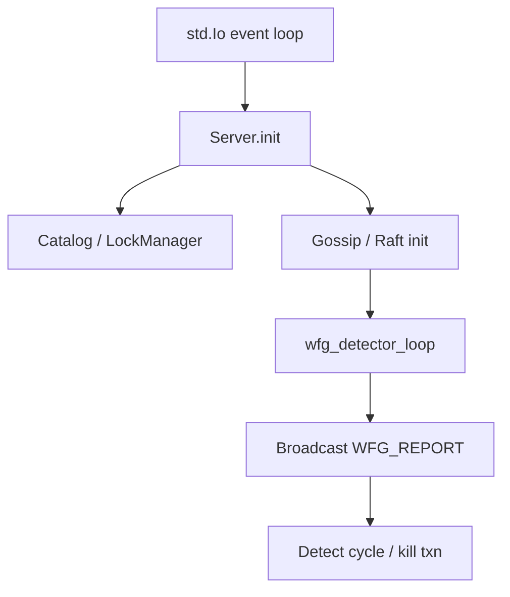

# Server Architecture

`src/server/server.zig` defines `Server` — the main DB instance. It is built around `std.Io` (line 13) which provides the event loop, threading, and I/O primitives. The server holds the catalog (`Catalog`, line 16), the lock manager (`LockManager`, line 78), an atomic next-txn-id counter (`std.atomic.Value(u32)`, line 23), and distributed-state objects: `gossip` (`GossipProtocol`, line 28), `raft` (`RaftGroup`, line 29), and a consistent-hash ring (`consistent_hash.ConsistentHashRing`, line 76). Shard identity is fixed at init (`shard_id`, `num_shards`, lines 87-88).

## Thread Model

`std.Io` drives a cooperative event loop (`io.sleep`, `io.read`, `io.write`). Transaction tracking (`start_txn`, line 185) uses an `active_txn_mutex` (line 19) plus `RwLock` for snapshot reads. The deadlock detector (`wfg_detector_loop`, line 96) runs in a background loop every 2 seconds, collecting WFG edges from the lock manager and broadcasting them via gossip.

## Key Design Decisions

- Cooperative concurrency via `std.Io` rather than OS threads per connection.
- Replication and sharding integrated at init (`gossip` + `raft` always created, even if null-checked later).
- `is_replica` (line 83) derived from `leader_address` presence; replicas start as followers handled by Raft.

Cross-links: `docs/implementation/concurrency/`, `docs/implementation/storage/`.
