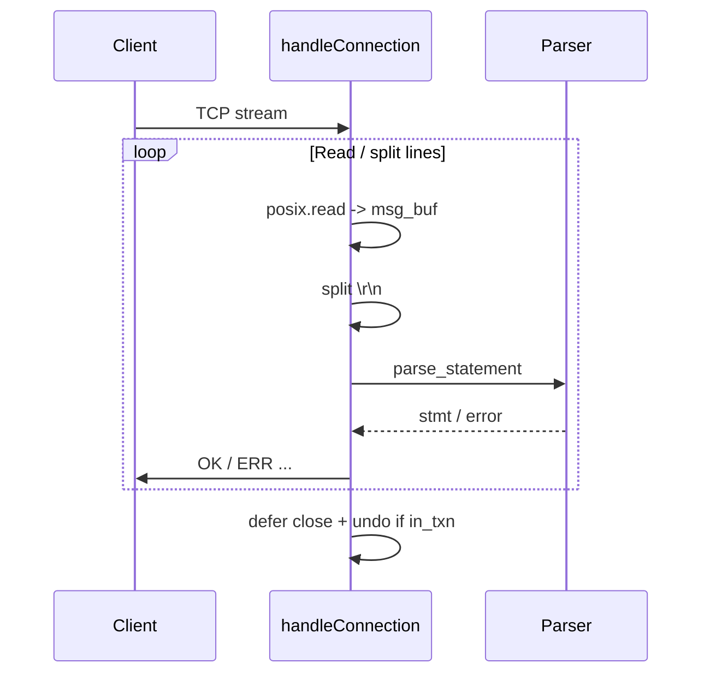

# Connection Lifecycle

`src/server/connection.zig`: `handleConnection` (line 9) accepts `stream: std.Io.net.Stream` and runs until EOF or error, then `defer stream.close(server.io)` (line 10). It uses a 131072-byte `msg_buf` (line 13) and reads via `std.posix.read` on `stream.socket.handle` (line 38). Multi-line queries are split on `\r\n` (line 42); leftover bytes shift via `std.mem.copyForwards`. Each line is duplicated (`line_slice`, line 48) and parsed (`parser.parse_statement`, line 124); on error it replies `ERR PARSER: ...` (line 126) and continues.

Transaction state (`in_transaction`, `txn_ctx`) is tracked per connection. The `defer` at line 24 rolls back via undo and writes an abort WAL record if the connection dies mid-transaction.

