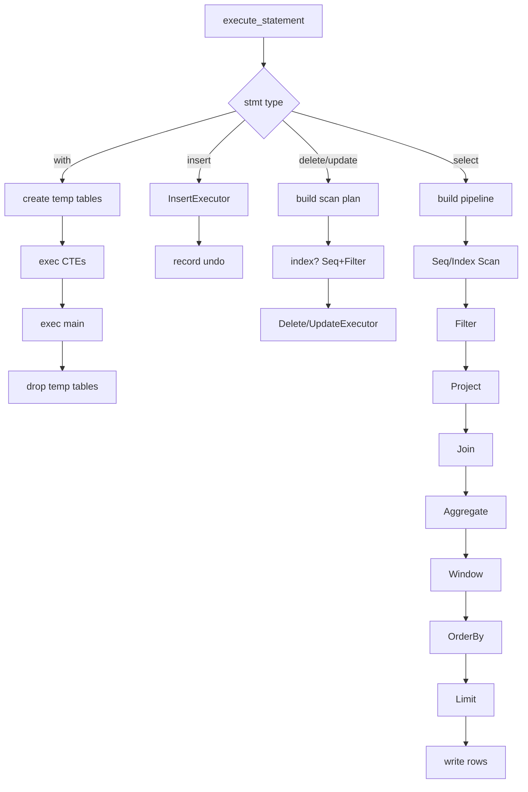

# Request Execution Pipeline

`src/server/execution.zig` drives statement execution from a parsed AST (`ast.Statement`). Entry points:

- `execute_statement` (line 70) → `execute_statement_internal` (line 81) which also handles subqueries, CTEs (`with`), `explain`, temp tables.
- `resolve_subqueries` (line 39) rewrites `compare_subquery` nodes into literal `compare` by running the subquery via `execute_statement_internal` (line 56) and taking `out_tuple[0]`.

Per-statement dispatch (lines 105-557):

| Statement | Action |
|-----------|--------|
| `.with` | create temp tables for each CTE, recurse into CTE body, then main statement, drop temp tables (lines 107-117) |
| `.create_table` / `.alter_table` / `.create_index` / `.drop_table` | catalog calls (lines 119-130) |
| `.insert` | `InsertExecutor` (lines 131-151); records undo `.delete_key` for rollback (lines 143-148) |
| `.delete` | builds scan (index or seq + filter) → `DeleteExecutor` (lines 153-204) |
| `.update` | builds scan → `UpdateExecutor` |
| `.select` | builds scan/filter/project/join/aggregate/order_by/limit/window → streams rows to `writer` |

Error responses are written via the `writer` passed from `handleConnection` (e.g. `ERR TABLE_NOT_FOUND`). `out_tuple` (line 88) captures single-row results for subquery resolution. `target_temp_table` (line 89) routes output into a temp table for CTEs.