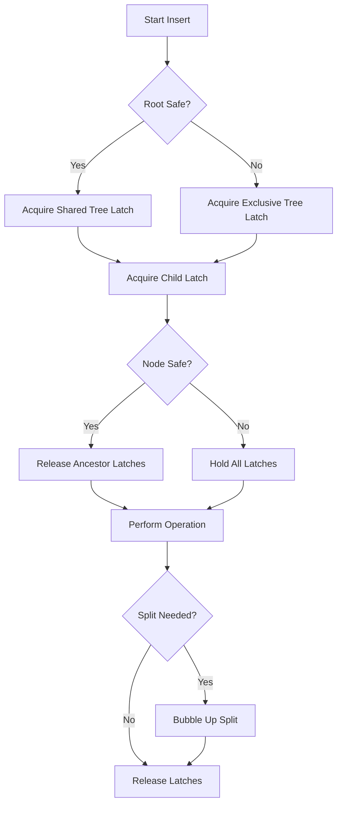

# B+Tree Implementation

## Overview
SimpleDB implements an unclustered B+Tree as the primary indexing structure. The tree uses latch-crabbing for high concurrency and active node merging for efficient deletions.

## Architecture

### BTree Structure
```zig
pub const BTree = struct {
    buffer_manager: *BufferManager,
    root_page_id: u32,
    next_alloc_page_id: *u32,
    tree_latch: std.Io.RwLock,
};
```

- **buffer_manager**: Reference to buffer pool for page access
- **root_page_id**: Logical page ID of the root node
- **next_alloc_page_id**: Pointer to page allocator counter
- **tree_latch**: Reader/writer lock for tree structure (used for root splits)

## Node Types

### Leaf Nodes
Store KeyValue pairs (key, record ID) and maintain a linked list via next_leaf pointer.

### Internal Nodes
Route keys to child pages using leftmost child pointer and InternalEntry array.

## Key Operations

### search(key)
1. Acquire tree_latch in shared mode
2. Fetch root frame and acquire its shared latch
3. Release tree_latch
4. Traverse down:
   - If leaf, perform binary search
   - If internal, fetch child, acquire its shared latch, release parent
5. Return RID or null

### scan(start_key, end_key)
1. Acquire tree_latch in shared mode
2. Traverse to leftmost leaf containing start_key
3. Iterate through linked list of leaves
4. Collect RIDs in range [start_key, end_key]
5. Stop when exceeding end_key

### insert(key, value)
1. Check if root is safe for insertion
2. If unsafe, acquire tree_latch exclusively (may cause root split)
3. Recursively insert using latch-crabbing
4. On split, bubble up split key
5. If root splits, allocate new root page

### delete(key)
1. Check if root is safe for deletion
2. If unsafe, acquire tree_latch exclusively
3. Recursively delete using latch-crabbing
4. If leaf becomes empty, remove from parent
5. If root becomes empty internal node, collapse to child

## Latch-Crabbing Protocol

### Concept
Latch-crabbing is a concurrency control technique where:
- Threads hold latches on a chain of nodes as they traverse
- When safe (node won't split/merge), ancestors are released
- Reduces lock contention vs. holding full path

### is_safe_for_insert()
- Leaf: num_keys < leaf_capacity (511)
- Internal: num_keys < internal_capacity (510)

### is_safe_for_delete()
- Leaf: num_keys > capacity / 2
- Internal: num_keys > capacity / 2

## Split and Merge Operations

### Leaf Split
- Split point: mid = num_keys / 2
- Right node gets keys [mid..num_keys]
- New leaf is linked into next_leaf chain
- Mid key is bubbled up to parent

### Internal Split
- Split point: mid = num_keys / 2
- Mid key is pushed up to parent
- Right node gets entries [mid+1..num_keys]
- Leftmost child of right node is ptr[mid].right_child

### Leaf Merge
- Combine all keys from right sibling into left
- Update next_leaf pointer
- Mark right sibling as empty

### Internal Merge
- Insert parent key between siblings
- Copy all entries from right to left
- Mark right sibling as empty

## Concurrency Model

### Tree Latch
- Protects root pointer changes
- Acquired shared for read operations
- Acquired exclusive for root splits/merges

### Node Latches
- Each node has its own RwLock
- Acquired shared during traversal
- Acquired exclusive during modification

## Trade-offs

### Advantages
- **High Concurrency**: Latch-crabbing allows parallel access
- **Efficient Deletes**: Active node merging prevents underutilization
- **Range Scans**: Leaf linked list enables sequential iteration

### Disadvantages
- **Complex Code**: Split/merge logic is intricate
- **Lock Ordering**: Must maintain consistent lock acquisition order
- **Worst-case Performance**: Sequential splits can cause cascading

### Alternatives
1. **B-Tree**: No separation between keys and data
2. **LSM-Tree**: Write-optimized, requires compaction
3. **Skip List**: Simpler but less cache-friendly
4. **Hash Index**: Faster point queries, no range scans

## Mermaid: Latch-Crabbing Flow


## Performance Characteristics

- **Search**: O(log n) with high concurrency
- **Insert**: O(log n) amortized with splits
- **Delete**: O(log n) with merges
- **Range Scan**: O(log n + k) where k is result size
- **Space**: ~70% utilization with active merging