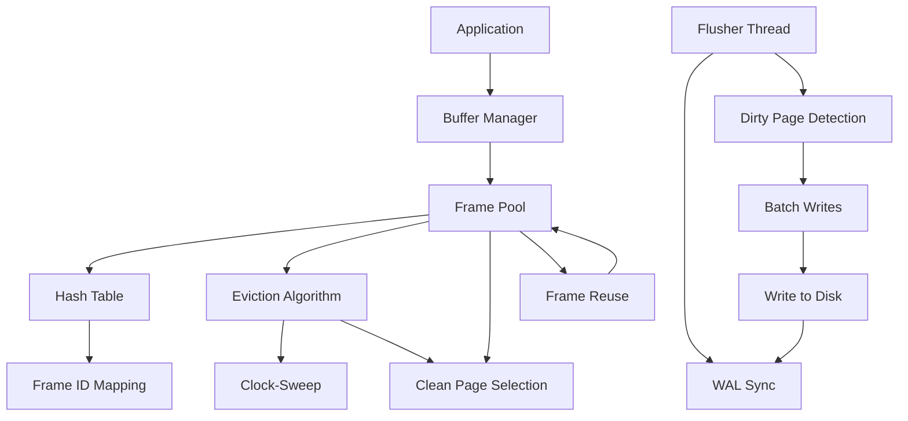

# Buffer Manager Implementation

## Overview
The Buffer Manager provides a high-performance, multi-threaded buffer pool with a Clock-Sweep (Second-Chance) eviction algorithm. It manages 4096 frames (pages) that can be pinned/unpinned by concurrent threads.

## Core Components

### Frame Structure
Each frame contains:
- frame_id: Unique identifier within the pool
- page_id: Logical page identifier (0, 1, 2, ...)
- page: The actual 8KB page data
- pin_count: Number of threads currently using this frame
- is_dirty: Whether the frame contains modified data
- usage_count: Access frequency metric for eviction decisions
- state: EMPTY, VALID, or other states
- latch: Per-frame read/write lock for synchronization
- io_mutex: Per-frame I/O synchronization

### Hash Table
- Map size: 8192 slots for O(1) average lookup
- Implementation: Inline chained hash map with hash_head array and hash_next array
- Hash function: `(page_id *% 2654435769) & (map_size - 1)`

## Thread Management

### Flusher Thread
- Periodically scans all frames for dirty pages
- Batches up to 128 pages for efficient WAL flushing
- Timeout: 10ms wait between scans
- Triggers WAL flush when dirty pages found

### Prefetcher Thread
- Maintains a circular queue of page IDs to read ahead
- Queue size: 64 entries
- Uses sequential access pattern (32 pages at a time)
- Enqueues prefetch requests via prefetch_event
- Implements LRU-like behavior with usage counters

## Eviction Algorithm (Clock-Sweep)
1. **Initialization**: Frame at position `self.hand` is examined
2. **Iteration**: Walk through all frames in circular order
3. **Clean Pages**: Count pages with zero pin count and no dirty status
4. **Eviction**: Select first clean page encountered
5. **Pin Count**: Decrement usage counters for frames being evicted
6. **Retry**: If no clean page found, continue to next frame (max iterations: pool_size * 12)

## Memory Management
- **Frame Pool**: Pre-allocated array of 4096 frames
- **Hash Memory**: Separate allocation for hash table structures
- **Efficient Reuse**: Frames are reused rather than allocated/freed

## Key Operations

### fetch_frame(page_id)
- **Lookup**: Uses hash table to find existing frame
- **Eviction**: Calls evict_page() if no frame found
- **Pinning**: Increments pin_count and usage_count
- **I/O Sync**: Locks io_mutex before I/O operations

### new_frame(page_id)
- **Eviction**: Selects victim frame to reuse
- **Zeroing**: New frames are zeroed for security
- **Dirty Handling**: Flushes old dirty frames to WAL
- **Memory Layout**: Frame metadata stored separately from page data

### unpin_frame(frame, is_dirty)
- **Pin Count**: Decrements pin_count
- **Dirty Flag**: Updates is_dirty based on parameter
- **I/O Sync**: Locks io_mutex during operation

## Trade-offs and Alternatives

### Advantages
- **Fine-grained Control**: Manual management of page lifecycle
- **Concurrency**: Multiple threads can access different frames simultaneously
- **Predictable Performance**: No OS page cache surprises
- **WAL Integration**: Direct support for Write-Ahead Log flushing

### Disadvantages
- **Complexity**: More code to maintain than OS page cache
- **Memory Overhead**: 4096 frames * (sizeof(Frame)) ~ 16MB+ memory
- **Manual Tuning**: Eviction thresholds and batch sizes need configuration

### Alternative Approaches
1. **OS Page Cache**: Rely on kernel's page cache (simpler, less control)
2. **Reference Counting**: Use reference counts instead of pin_count
3. **LRU**: Least Recently Used eviction instead of Clock-Sweep
4. **Adaptive**: Adjust eviction based on I/O patterns

## Mermaid Diagram

## Performance Considerations
- **Cache Locality**: Frames are accessed sequentially in prefetch
- **Lock Contention**: Minimized by per-frame locks and I/O mutexes
- **Memory Usage**: 4096 frames * (frame_size + overhead) ~ 16-32MB
- **Throughput**: Batch operations reduce per-page overhead
- **Latency**: Background threads hide I/O latency

## Future Improvements
- **Adaptive Batch Sizes**: Adjust based on I/O patterns
- **Tiered Prefetching**: Different strategies for sequential vs random access
- **Compression**: Compress pages before writing to reduce I/O
- **Metrics**: Add statistics for monitoring and tuning