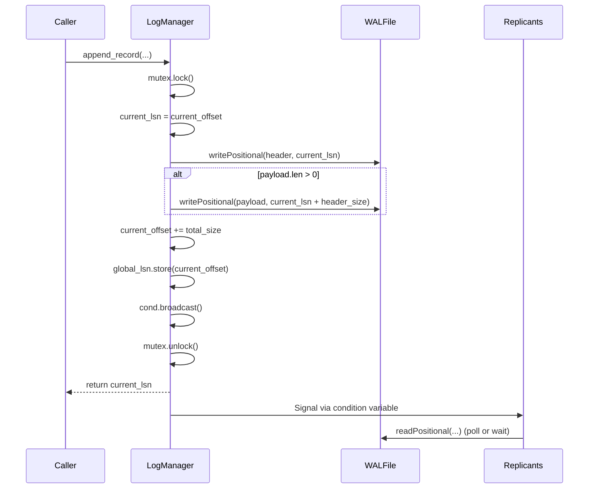
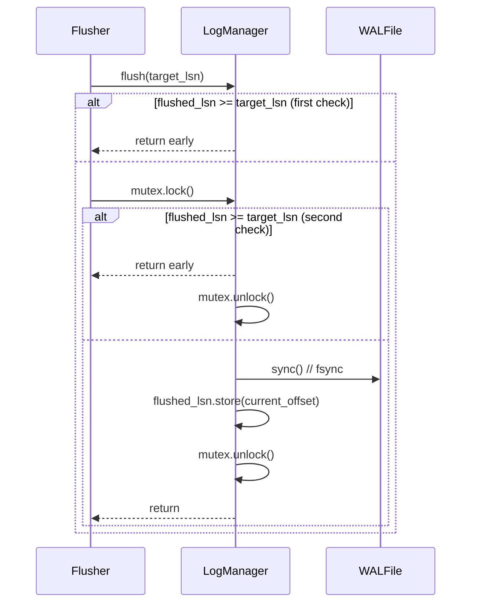

# Log Manager

## Overview
The `LogManager` handles the Write-Ahead Log (WAL) subsystem, ensuring durability through atomic log writes, efficient flushing, and replication support. LSN (Log Sequence Number) is implemented as a file offset for direct positional I/O.

Source: `src/storage/wal/log_manager.zig`

## Core Structure

```zig
pub const LogManager = struct {
    io: std.Io,
    wal_file: std.Io.File,
    mutex: std.Io.Mutex,
    global_lsn: std.atomic.Value(u32),
    flushed_lsn: std.atomic.Value(u32),
    current_offset: u32, // The physical offset in the file, which we use as the LSN
    cond: std.Io.Condition,
    current_term: ?*std.atomic.Value(u64),
};
```

### Key Fields

| Field | Purpose | Notes |
|-------|---------|-------|
| `io` | I/O interface | Abstracts OS I/O operations |
| `wal_file` | WAL file handle | Opened for read/write/append |
| `mutex` | Synchronization | Protects concurrent access |
| `global_lsn` | Atomic LSN tracker | Last LSN assigned (`store` on append) |
| `flushed_lsn` | Atomic flush tracker | Last LSN persisted to disk |
| `current_offset` | Next write position | Physical file offset = next LSN |
| `cond` | Condition variable | Signals replication consumers |
| `current_term` | Raft term (optional) | For leader election in replication |

## LSN as File Offset

The system implements LSN as a direct file offset:
- **Monotonically increasing**: Each append advances `current_offset`
- **Enables positional I/O**: `readPositional`/`writePositional` at exact LSN
- **Simplifies replication**: Stream log records by reading sequential offsets
- **Crash safety**: Recovery scans from offset 0 to `current_offset`

## Key Operations

### append_record()
```zig
pub fn append_record(
    self: *LogManager,
    txn_id: u32,
    prev_lsn: u32,
    record_type: LogRecordType,
    page_id: u32,
    offset: u16,
    payload: []const u8,
) !u32
```

**Steps**:
1. **Calculate sizes**: `header_size + payload.len`
2. **Acquire mutex**: `mutex.lockUncancelable(io)` (defer unlock)
3. **Capture current LSN**: `current_lsn = self.current_offset`
4. **Build header**: Set term, lsn, prev_lsn, txn_id, length, page_id, offset, record_type
5. **Write header**: At `current_lsn`
6. **Write payload**: If non-empty, at `current_lsn + header_size`
7. **Update state**:
   - `self.current_offset += total_size`
   - `self.global_lsn.store(self.current_offset, .release)`
   - `self.cond.broadcast(io)` → Signals replication waiters
8. **Release mutex**: Via defer
9. **Return LSN**: The `current_lsn` captured in step 3

**Atomicity Guarantee**: The entire operation (header + payload) is atomic under the mutex. No other thread can interleave writes.

### flush(lsn)
```zig
pub fn flush(self: *LogManager, lsn: u32) !void
```

**Algorithm (Double-Checked Locking)**:
1. **First check (no lock)**: If `flushed_lsn >= lsn`, return early
2. **Acquire mutex**: `mutex.lockUncancelable(io)` (defer unlock)
3. **Second check (with lock)**: Re-check `flushed_lsn >= lsn` (another thread may have flushed)
4. **Persist to disk**: `wal_file.sync(io)` → Issues `fsync`/`fdatasync`
5. **Update flushed_lsn**: Store `current_offset` (all data up to now is flushed)
6. **Release mutex**: Via defer

**Why Double-Checked?**: Avoids mutex contention when LSN is already flushed, while preventing race where:
- Thread A: checks `flushed_lsn` (too low) → about to lock
- Thread B: flushes higher LSN → releases lock
- Thread A: locks → would unnecessarily flush again

## Replication Support

### Condition Variable Broadcasting
- Every `append_record` calls `self.cond.broadcast(self.io)`
- Replication consumers can wait on this condition for new log records
- Enables **push-based** replication without polling

### Logical Records for Replication
The `LogRecordType` enum includes:
- `logical_insert` (8): Contains `(key, data)` for INSERT operations
- `logical_delete` (9): Contains `key` for DELETE operations

These allow replicas to apply changes **without re-executing SQL**, improving replication throughput.

## Mermaid: Append Flow



## Mermaid: Flush Flow



## Thread Safety

All public methods are thread-safe:
- `append_record()`: Uses `mutex.lockUncancelable` for exclusive access
- `flush()`: Uses double-checked locking with mutex
- Atomic fields (`global_lsn`, `flushed_lsn`) use `.release`/`.acquire` ordering
- Condition variable operations are protected by the same mutex

## Performance Considerations

### Advantages
- **Batched I/O**: Header and payload written in separate but sequential syscalls
- **Minimal locking**: Critical section only covers actual WAL writes
- **Efficient flushing**: Avoids unnecessary fsync via double-checked check
- **Replication signaling**: Condition variable avoids busy polling

### Trade-offs
| Aspect | Choice | Reason |
|--------|--------|--------|
| Mutex granularity | Single mutex | Simplicity; WAL is inherently sequential bottleneck |
| Flush unit | Per-LSN | Flexible; caller decides durability vs latency |
| Replication signal | Condition variable | Efficient waiting vs polling overhead |
| Atomic LSN updates | Release on store | Ensures visibility of log data before LSN update |

## Related Documentation
- [Recovery Manager](./recovery_manager.md) — ARIES recovery passes, ATT/DPT
- [Log Record Format](./log_record.md) — Header structure, record types, encoding
- [Transaction Context](./transaction.md) — TransactionContext, undo log, row locks
- [WAL Overview](../wal.md) — High-level WAL architecture and trade-offs

## Cross-References in Code
- `src/storage/wal/log_manager.zig` — Main implementation
- `src/storage/wal/log_record.zig` — LogRecordHeader, LogRecordType
- `src/storage/wal/recovery_manager.zig` — Uses LogManager for WAL reading during recovery
- `src/storage/wal/transaction.zig` — TransactionContext provides txn_id, prev_lsn for append