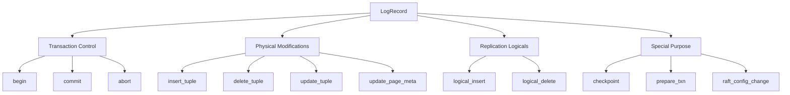
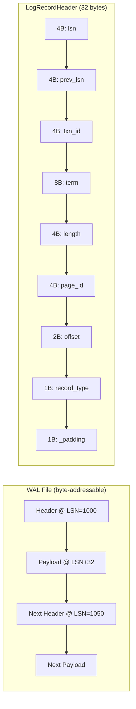

# Log Record Format

## Overview
This document details the **physical structure** of Write-Ahead Log (WAL) records in SimpleDB. The format defines how transactions, modifications, and control information are persisted to durable storage for crash recovery and replication.

Source: `src/storage/wal/log_record.zig`

## Core Structures

### LogRecordType
```zig
pub const LogRecordType = enum(u8) {
    begin = 0,
    commit = 1,
    abort = 2,
    insert_tuple = 3,
    delete_tuple = 4,
    update_tuple = 5,
    update_page_meta = 6,
    checkpoint = 7,
    logical_insert = 8,
    logical_delete = 9,
    prepare_txn = 10,
    raft_config_change = 11,
};
```

| Type | Value | Purpose |
|------|-------|---------|
| `begin` | 0 | Transaction start marker |
| `commit` | 1 | Transaction commit |
| `abort` | 2 | Transaction abort/rollback |
| `insert_tuple` | 3 | Physically insert tuple onto page |
| `delete_tuple` | 4 | Physically delete tuple from page |
| `update_tuple` | 5 | Physically update tuple in-place |
| `update_page_meta` | 6 | Change page metadata (e.g., free space) |
| `checkpoint` | 7 | ARIES checkpoint record |
| `logical_insert` | 8 | For replication: (key, value) |
| `logical_delete` | 9 | For replication: key only |
| `prepare_txn` | 10 | Two-phase commit prepare |
| `raft_config_change` | 11 | Raft cluster membership change |

**Note**: The enum here differs from the outdated version in `docs/implementation/storage/wal.md`. This is the **source of truth**.

### LogRecordHeader
```zig
pub const LogRecordHeader = extern struct {
    lsn: u32,
    prev_lsn: u32,
    txn_id: u32,
    term: u64,
    length: u32, // Length of the entire record including header and payload
    page_id: u32,
    offset: u16,
    record_type: LogRecordType,
    _padding: u8,
};
```

#### Field-by-Field Breakdown

| Field | Size | Offset | Purpose | Notes |
|-------|------|--------|---------|-------|
| `lsn` | 4B | 0 | Log Sequence Number | **File offset** where this record starts |
| `prev_lsn` | 4B | 4 | Previous LSN for this txn | Undo chain linkage |
| `txn_id` | 4B | 8 | Transaction ID | Owner of this change |
| `term` | 8B | 12 | Raft leader term | For replication consistency |
| `length` | 4B | 20 | Total record size | `header_size + payload.len` |
| `page_id` | 4B | 24 | Affected page ID | Target of modification |
| `offset` | 2B | 28 | Offset within page | Where on the page |
| `record_type` | 1B | 30 | Type of log record | Determines payload interpretation |
| `_padding` | 1B | 31 | Alignment padding | Ensures 32-bit alignment |
| **TOTAL** | **32B** | — | — | — |

**Key Observations**:
- Fixed 32-byte header (no variable-length fields)
- `extern struct`: Exact C-like layout, no Zig-specific optimizations
- `length` includes header → minimum record size is 32 bytes
- `term` is 64-bit for Raft term numbers (can grow large over time)
- No checksum — relies on underlying storage/disk integrity

### LogRecord (In-Memory Representation)
```zig
pub const LogRecord = struct {
    header: LogRecordHeader,
    payload: []const u8,
    ...
};
```

**Usage**: After reading a header from WAL, the payload is sliced from the file buffer at `lsn + @sizeOf(LogRecordHeader)` with length `header.length - @sizeOf(LogRecordHeader)`.

## Physical Layout on Disk

```
+------------------+------------------+------------------+
|   Header (32B)   |   Payload (N)    |   Next Record    |
+------------------+------------------+------------------+
    LSN: X           LSN+32          LSN+32+N
```

**Example**: An `insert_tuple` record:
- Header: `lsn=1000`, `length=50` (32B header + 18B payload)
- Payload: The raw bytes of the inserted tuple
- Next record starts at LSN `1000 + 50 = 1050`

## Record Type Semantics

### Transaction Control
| Type | When Written | Payload |
|------|--------------|---------|
| `begin` | Transaction start | Empty |
| `commit` | Successful commit | Empty |
| `abort` | Transaction rollback | Empty |

### Data Modifications (Physical)
These records describe **exact byte changes** to database pages — used by ARIES redo/undo.

| Type | Meaning | Typical Payload |
|------|---------|-----------------|
| `insert_tuple` | Insert tuple at `offset` | Tuple data |
| `delete_tuple` | Delete tuple starting at `offset` | Often empty (location implies which tuple) |
| `update_tuple` | Modify tuple in-place | New tuple data (same length as old) |
| `update_page_meta` | Change page header/free space | Delta to page metadata |

### Replication Logicals
Designed for **statement-free replication** — replicas apply without SQL re-execution.

| Type | Payload Format | Applied By Replica As |
|------|----------------|------------------------|
| `logical_insert` | `(key: []u8, data: []u8)` | Catalog INSERT |
| `logical_delete` | `(key: []u8)` | Catalog DELETE |

### Special Purpose
| Type | When Written | Purpose |
|------|--------------|---------|
| `checkpoint` | Periodic | Marks end of active transaction table for faster recovery |
| `prepare_txn` | 2PC prepare | Durable record of prepare vote |
| `raft_config_change` | Cluster reconfig | New peer list, voting rights, etc. |

## Encoding Details

### Integer Encoding
All integers are stored in **little-endian** byte order (native to x86):
```zig
// LSN: u32 = 0x12345678
// Bytes on disk: 78 56 34 12
```

### Payload Encoding
- **Application-defined**: The WAL layer treats payload as opaque `[]const u8`
- **Tuple format**: Defined by the storage layer (`src/storage/table.zig`)
- **Logical records**: Must serialize key/value pairs (e.g., length-prefixed)
- **No compression**: Records are written as-is for simplicity

### Alignment and Padding
- Header is 32 bytes → naturally 32-bit aligned
- `_padding` byte ensures total size is multiple of 4 bytes
- Payload starts at `header_size` (32) → always 32-bit aligned
- No further alignment guarantees for payload

## Mermaid: Header Bit Layout

```mermaid
bitmap
    "LogRecordHeader (32 bytes)"
    "lsn" : 32
    "prev_lsn" : 32
    "txn_id" : 32
    "term" : 64
    "length" : 32
    "page_id" : 32
    "offset" : 16
    "record_type" : 8
    "_padding" : 8
```

## Mermaid: Record Type Hierarchy



## Mermaid: On-Disk Layout



## Performance Characteristics

### Space Overhead
- **Minimum record**: 32 bytes (header only, e.g., commit/abort)
- **Typical tuple**: 32B header + tuple size (often 64-256B+)
- **Fixed header cost**: Amortized over payload; negligible for large records

### Access Patterns
- **Append-only**: Strictly increasing file offsets
- **Sequential scan**: Recovery reads forward from offset 0
- **Random access**: Flush/replication read specific LSN ranges
- **Locality**: Related records (same txn) scattered by interleaving

### Atomicity Guarantees
- **Single-record atomicity**: Header + payload written under LogManager mutex
- **Cross-record atomicity**: Not guaranteed (requires group commit, not implemented)
- **Crash consistency**: WAL invariant — if record is valid (length matches, LSN matches offset), it was fully written

## Trade-offs and Limitations

### Current Design Choices
| Aspect | Decision | Rationale |
|--------|----------|-----------|
| Fixed header | 32 bytes | Simplicity, predictable layout |
| LSN = file offset | Direct mapping | Enables positional I/O, replication streaming |
| No checksum | Rely on hardware | Reduces CPU overhead; assumes disk integrity |
| Little-endian | Native to x86 | Avoids byte-swapping cost |
| Application-defined payload | Flexibility | WAL layer agnostic to tuple format |

### Limitations and Future Work
| Limitation | Impact | Possible Solution |
|------------|--------|-------------------|
| Fixed 32B header | Limits extensibility | Versioned headers, TLV format |
| No record compression | Wasted space for repetitive payloads | Dictionary compression, delta encoding |
| Payload alignment | None beyond 32B start | Explicit alignment directives |
| No record spanning | Large blobs must fit in one record | Segmented records with continuation type |
| Atomicity per-record only | Torn writes possible across records | Group commit with batch fsync |

### Comparison to Alternatives
| Format | Pros | Cons |
|--------|------|------|
| **Current (fixed header)** | Simple, fast parsing, predictable | Fixed overhead, limited flexibility |
| **JSON/Text** | Human-readable, self-describing | Verbose, slow parse, no binary efficiency |
| **Protocol Buffers** | Compact, schema evolution | Parse overhead, schema management |
| **Cap'n Proto/FlatBuffers** | Zero-copy, schema evolution | Complex implementation, less flexible |
| **TLV (Type-Length-Value)** | Extensible, compact for sparse fields | Parse overhead, alignment complexity |

## Related Documentation
- [Log Manager](./log_manager.md) — How records are appended and flushed
- [Recovery Manager](./recovery_manager.md) — How records are interpreted during ARIES passes
- [Transaction Context](./transaction.md) — How txn_id and prev_lsn are managed
- [WAL Overview](../wal.md) — High-level architecture and trade-offs

## Cross-References in Code
- `src/storage/wal/log_record.zig` — Header and type definitions
- `src/storage/wal/log_manager.zig` — append_record() builds header
- `src/storage/wal/recovery_manager.zig` — Parses header during all three passes
- `src/storage/wal/transaction.zig` — TransactionContext provides txn_id, prev_lsn
- `src/storage/table.zig` — Actual tuple format (payload for insert_tuple/etc.)