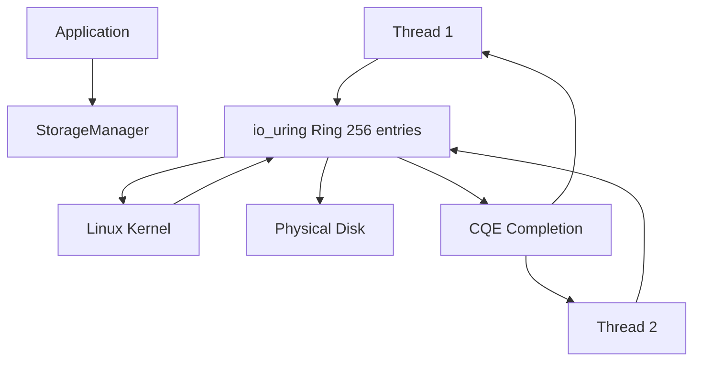

# Storage Manager Implementation

## Overview
The Storage Manager provides low-level asynchronous I/O operations directly with the Linux kernel using io_uring. It bypasses conventional blocking I/O to enable high-throughput, concurrent disk operations.

## I/O Architecture

### io_uring Usage
- SQE/CQE Queue Management: Submit Queue Entries (SQEs) are submitted to the kernel, which processes them asynchronously and completes them with Completion Queue Entries (CQEs).
- Ring Size: Configured with 256 entries to balance memory usage and queue depth.
- Leader-Follower Pattern: Leader thread processes CQEs from kernel using io_uring_enter with IORING_ENTER_GETEVENTS. Followers wait using std.Thread.yield().

### Mutex and Synchronization
- ring_mutex: Protects access to the io_uring submission queue
- leader_lock: Atomic boolean to elect a Leader among follower threads
- std.Thread.yield(): Efficient polling for CQE availability when waiting to be a follower

## Page Operations

### read_page and write_page
- Calculate file offset: offset = page_id * page_size
- Submit SQE for reading/writing a single 8KB page
- Wait for CQE completion via wait_for_cqe()

### read_pages / write_pages (batch operations)
- Batch Size: Up to 128 pages per operation
- Each page has its own IoContext for completion tracking
- All SQE submissions occur under ring_mutex protection

## Initialization
- Opens or creates the database file with O_DIRECT for unbuffered I/O
- Falls back to normal I/O if O_DIRECT fails
- Initializes io_uring ring with 256 entries

## Trade-offs

### Advantages
- High Throughput: Non-blocking I/O enables concurrent operations
- Low Latency: Direct kernel bypass with io_uring
- Scalable: Supports multiple concurrent readers/writers

### Disadvantages
- Complex API: Manual queue management compared to standard file I/O
- Kernel Dependency: Limited to Linux systems with io_uring support
- Resource Management: Requires careful coordination

## Mermaid Diagram

## Future Extensions
- Zero-copy I/O
- I/O Polling with POLL_RING
- Metrics collection for monitoring and tuning