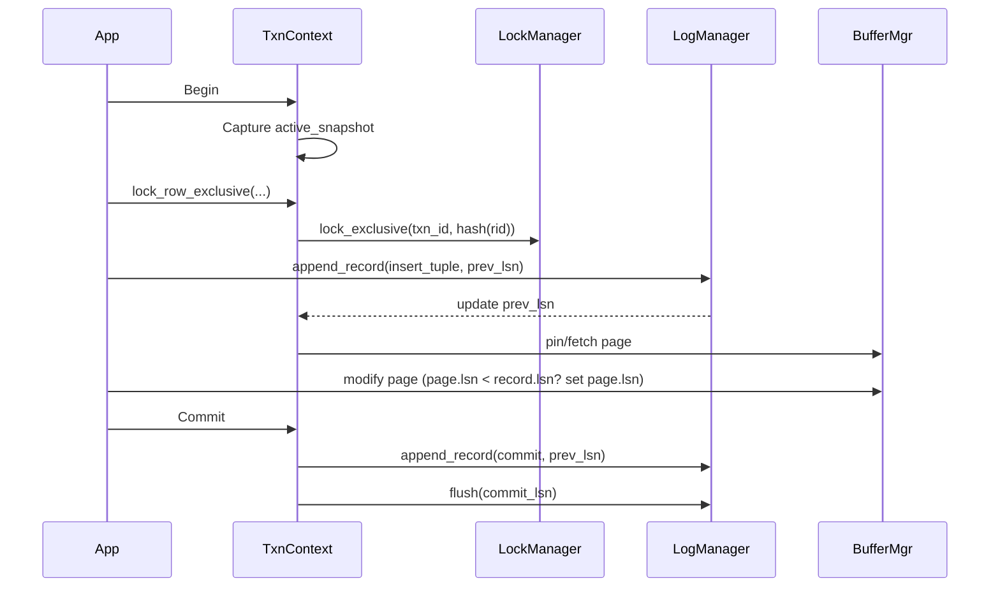
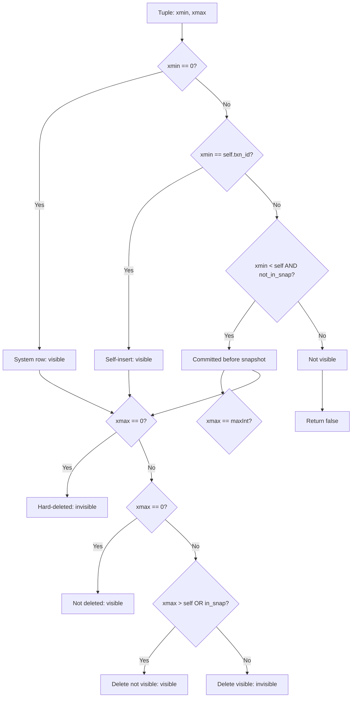

# Transaction Context

## Overview
The `TransactionContext` (in `src/storage/wal/transaction.zig`) holds per-transaction runtime state, including MVCC visibility snapshots, lock management integration, and LSN tracking for the undo chain.

## Core Structures

### ActiveSnapshot
```zig
pub const ActiveSnapshot = struct {
    items: [256]u32 = undefined,
    len: usize = 0,
    ...
};
```

A **fixed-capacity** (256) array of active transaction IDs, used for MVCC visibility checks. The fixed size is a deliberate trade-off: simpler allocation, bounded memory, but a hard limit on concurrent transactions visible to a snapshot.

| Field | Purpose | Notes |
|-------|---------|-------|
| `items` | Transaction IDs currently active | Stack-allocated array |
| `len` | Count of items | Bounds-checked in `append()` |

**`append(val)`**: Adds a txn_id; returns `error.TooManyActiveTransactions` if full.
**`slice()`**: Returns `items[0..len]` as an immutable view.

### TransactionContext
```zig
pub const TransactionContext = struct {
    txn_id: u32,
    prev_lsn: u32 = 0,
    lock_manager: ?@import("../concurrency/lock_manager.zig").LockManager = null,
    active_snapshot: ?ActiveSnapshot = null,
    ...
};
```

| Field | Purpose |
|-------|---------|
| `txn_id` | Unique transaction identifier |
| `prev_lsn` | Back-pointer into WAL for undo chain traversal |
| `lock_manager` | Optional lock manager for pessimistic locking |
| `active_snapshot` | Optional MVCC snapshot for visibility checks |

## MVCC Visibility

### is_visible(xmin, xmax)
Implements **snapshot-based visibility** — the core of MVCC. Given a tuple's `xmin` (creating txn) and `xmax` (deleting txn), determines if the tuple is visible to this transaction.

**Source**: `transaction.zig:28-59`

#### Algorithm (Creating Side — xmin)
```
not_in_snap = true
if snapshot exists:
    not_in_snap = (xmin not in snapshot)

created_visible = (xmin == 0)           // System transaction: always visible
               OR (xmin == self.txn_id)  // Self-inserted: visible
               OR (xmin < self.txn_id AND not_in_snap)  // Committed before snapshot
```

`xmin == 0` is a **special system transaction** that is always visible — used for bootstrap data.

#### Algorithm (Deleting Side — xmax)
```
in_snap = false
if snapshot exists:
    in_snap = (xmax in snapshot)

not_deleted = (xmax == 0)            // No deleter: not deleted
           OR (xmax > self.txn_id)   // Created after me: not yet visible
           OR in_snap                // Still active: deletion not committed
```

`xmax == std.math.maxInt(u32)` → **return false** (always invisible, means hard-deleted).

#### Truth Table
| Condition | xmin visible? | xmax visible? | Tuple visible? |
|-----------|---------------|---------------|-----------------|
| System row | ✓ (xmin=0) | — | ✓ |
| Self-insert | ✓ (xmin=self) | — | ✓ |
| Committed before snapshot | ✓ (xmin < self, not in snap) | — | ✓ |
| Active at snapshot | ✗ | — | ✗ |
| Uncommitted | ✗ | — | ✗ |
| No deleter | — | ✓ (xmax=0) | ✓ |
| Deleted by later txn | — | ✓ (xmax > self) | ✓ |
| Deleted by active txn | — | ✗ (in snap) | ✓ |
| Hard-deleted | — | ✗ (xmax=maxint) | ✗ |

### Snapshot Isolation
- `active_snapshot` is set when a transaction starts a read query or statement
- Captured at transaction start time (snapshot isolation)
- Readers and writers **do not block** each other (MVCC)
- The 256-transaction snapshot cap means long-running transactions with many concurrent writers may fail

## Undo Log Integration

### prev_lsn Chain
The `prev_lsn` field connects log records into a **per-transaction linked list** via backward pointers:
- Each log record stores the LSN of the previous record for the same transaction
- `TransactionContext.prev_lsn` tracks the **current** tail
- Updated by `append_record()` caller to the returned LSN

**Recovery usage**: The undo pass follows `prev_lsn` chains backward to undo all changes from an uncommitted transaction (`recovery_manager.zig:175-177`).

## Row Locking

### lock_row_shared(root_page_id, rid)
```zig
pub fn lock_row_shared(self: *TransactionContext, root_page_id: u32, rid: u64) !void
```
**No-op**: Readers do not block writers under MVCC. Returns immediately without acquiring any lock.

### lock_row_exclusive(root_page_id, rid)
```zig
pub fn lock_row_exclusive(self: *TransactionContext, root_page_id: u32, rid: u64) !void
```
**Purpose**: Acquires an exclusive row lock for write operations.

**Algorithm**:
1. If `lock_manager` is `null` → skip (pessimistic locking disabled)
2. Hash `(root_page_id, rid)` using Wyhash
3. Call `lm.lock_exclusive(txn_id, hash)` → blocks until lock acquired

**Why hashing?**: Lock managers typically index locks by a single key. Combining `root_page_id` and `row_id` into a 64-bit hash gives a unique composite key while keeping the lock manager's interface simple.

## Mermaid: Transaction Lifecycle



## Mermaid: MVCC Visibility Check



## Concurrency Integration

### Lock Manager
- Referenced: `src/storage/concurrency/lock_manager.zig`
- Optional: transactions without a lock manager skip locking entirely
- Uses Wait-For Graph (WFG) deadlock detection — see [Concurrency docs](../concurrency/mvcc.md)

### MVCC
- Uses snapshot isolation (not serializable)
- ActiveSnapshot captured at statement or transaction start
- No read locks → readers never block writers, writers never block readers

### Relationship with Buffer Manager
- Transaction's `prev_lsn` is used during recovery's undo pass
- Page LSN updates (`page.header.lsn = record.lsn`) ensure redo/undo correctness
- Buffer manager's `unpin_frame(frame, dirty)` commits modifications

## Related Documentation
- [Log Manager](./log_manager.md) — append_record, flush, LSN allocation
- [Recovery Manager](./recovery_manager.md) — ARIES undo using prev_lsn chain
- [Log Record Format](./log_record.md) — LogRecordHeader structure
- [WAL Overview](../wal.md) — High-level architecture
- [MVCC and Concurrency](../concurrency/mvcc.md) — Lock manager, WFG deadlock detection

## Cross-References in Code
- `src/storage/wal/transaction.zig` — Main implementation
- `src/storage/concurrency/lock_manager.zig` — LockManager referenced by TransactionContext
- `src/storage/wal/log_manager.zig` — append_record() uses txn_id and prev_lsn
- `src/storage/wal/recovery_manager.zig` — Follows prev_lsn chain during undo pass