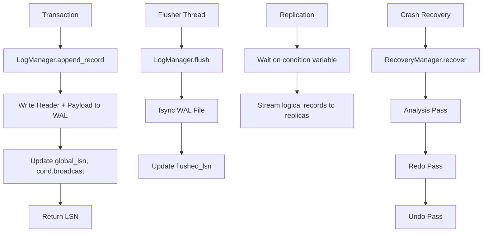

# Write-Ahead Log (WAL) Implementation

## Overview
SimpleDB implements a physical logging WAL following ARIES principles. The WAL ensures durability and enables crash recovery. This is the top-level overview — detailed implementation guides are linked below.

## Architecture

## Subsystem Guides

| Guide | Focus |
|-------|-------|
| [Log Record Format](./log_record.md) | Header structure, record types, encoding, on-disk layout |
| [Log Manager](./log_manager.md) | append, flush, LSN allocation, replication triggers |
| [Transaction Context](./transaction.md) | TransactionContext, undo log, row locks, MVCC visibility |
| [Recovery Manager](./recovery_manager.md) | ARIES analysis, redo, and undo passes |

## High-Level Design Decisions

### LSN as File Offset
- LSN = physical byte offset in WAL file
- Monotonically increasing
- Enables direct positional I/O for replication and recovery

### ARIES Recovery
Three-pass recovery runs at startup:
1. **Analysis**: Reconstruct ATT (Active Transaction Table) and DPT (Dirty Page Table)
2. **Redo**: Reapply all changes from LSN ≥ min(recLSN) in DPT
3. **Undo**: Roll back transactions in ATT following prev_lsn chains

### MVCC with Row Locking
- Readers never block writers (snapshot isolation)
- Row locks acquired on exclusive access via lock_manager
- Undo chain (`prev_lsn`) supports crash-time rollback

### Replication
- Leader writes physical WAL records
- Logical records (`logical_insert`, `logical_delete`) generated for streaming
- Replicas apply to local catalog without SQL re-execution
- Condition variable broadcasts signal waiting replicants

## See Also
- Source: `src/storage/wal/` — All WAL implementation files
- `src/storage/wal/log_record.zig` — LogRecordHeader, LogRecordType enum
- `src/storage/wal/log_manager.zig` — LogManager struct and key operations
- `src/storage/wal/transaction.zig` — TransactionContext, ActiveSnapshot, locking
- `src/storage/wal/recovery_manager.zig` — RecoveryManager, ATT, DPT